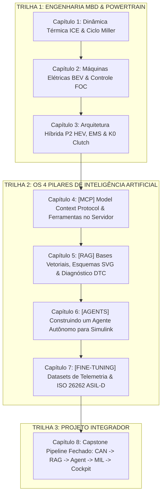

# NexusMBD // Master Curriculum & Course Planner
## AI-Native Powertrain Engineering Suite: Model-Based Design & Os 4 Pilares de IA

**Status do Curso:** Estrutura homologada e validada em código executável no repositório.  
**Carga Horária Estimada:** 60 Horas (Teoria Matemática, Modelagem MBD, Laboratórios MIL e Implementação de IA).  
**Público-Alvo:** Engenheiros de Sistemas Automotivos, Engenheiros de Controle & Calibração, Desenvolvedores de Software Embarcado e Engenheiros de IA/ML.

---

## 🎯 A Filosofia Pedagógica do Curso

O **NexusMBD** rompe a barreira entre a engenharia automotiva tradicional (**Model-Based Design no MATLAB/Simulink**) e a **Inteligência Artificial de Fronteira**. 

O curso foi concebido para que o aluno não seja apenas um consumidor de ferramentas prontas, mas **o arquiteto que constrói cada componente do ecossistema**:
1. **No Pilar [AGENT]:** O aluno constrói do zero um Agente ReAct autônomo capaz de abrir o Simulink, injetar testes e calibrar controladores.
2. **No Pilar [RAG]:** O aluno aprende a conectar, indexar e recuperar boas fontes técnicas (manuais de alta tensão, diagramas de topologia SVG e árvores de falhas DTC).
3. **No Pilar [FINE-TUNING]:** O aluno aprende a criar datasets sintéticos de telemetria, formatar prompts para domínio automotivo e treinar modelos sob a norma **ISO 26262 (ASIL-D)**.
4. **No Pilar [MCP]:** O aluno implementa servidores JSON-RPC com ferramentas robustas de decodificação CAN DBC e streaming físico a 100ms.

---

## 🗺️ Mapa Completo de Módulos e Capítulos

---

## 📘 Detalhamento de Cada Capítulo

### CAPÍTULO 1: Dinâmica Térmica ICE, Ciclo Miller & MBD
* **Domínio de Engenharia:** Termodinâmica de Motores de Combustão Interna e Dinâmica de Fluidos Compressíveis.
* **Tópicos Abordados:**
  * O princípio do Ciclo Miller com Fechamento Antecipado da Válvula de Admissão (EIVC).
  * Por que o ciclo Miller é a escolha perfeita para o Híbrido P2 (compensação de torque em baixa pelo PMSM).
  * Equação diferencial da pressão do coletor de admissão ($P_m$) pelo método *Speed-Density*.
  * Mapeamento de Consumo Específico (BSFC) e localização analítica do *Sweet Spot* ($230\text{ g/kWh} \implies 41\%$ de eficiência térmica).
  * Segregação do modelo nos 4 Solvers MBD (`COMUNICACAO`, `SOFTECU`, `MDL`, `OUT`).
* **Entregável Prático do Aluno:** Script em Python (`powertrain_models.py`) validando a resposta transitória de pressão MAP sob degrau de borboleta de 20% a 80%.

---

### CAPÍTULO 2: Eletrificação, Máquinas Elétricas PMSM & Controle FOC
* **Domínio de Engenharia:** Máquinas Elétricas de Ímãs Permanentes e Controle Vetorial em Tempo Real.
* **Tópicos Abordados:**
  * Princípio físico do Motor Síncrono de Ímãs Permanentes de Fluxo Radial (PMSM).
  * Transformadas de Clarke ($abc \to \alpha\beta$) e Park ($\alpha\beta \to dq$) invariantes em potência.
  * Controle por Orientação de Campo (FOC): Desacoplamento entre fluxo magnético ($I_d$) e produção de torque ($I_q$).
  * Modulação por Vetor Espacial (SVPWM) e inversor trifásico de alta tensão com chaveamento IGBT/SiC.
  * Dimensionamento analítico das malhas de corrente PI e sintonia anti-windup.
* **Entregável Prático do Aluno:** Rotina MATLAB (`export_pmsm_calibration.m`) calculando os ganhos $K_p, K_i$ das malhas de corrente para pico de $200\text{ A}$ a $311\text{ Hz}$.

---

### CAPÍTULO 3: Arquitetura Híbrida P2, Estratégia EMS & Embreagem K0
* **Domínio de Engenharia:** Trens de Força Híbridos Paralelos e Controle Eletro-Hidráulico.
* **Tópicos Abordados:**
  * Cinemática e dinâmica de acoplamento da topologia P2 (ICE &rarr; K0 &rarr; PMSM &rarr; e-DCT).
  * Modelagem dos 4 estados da embreagem K0: `OPEN`, `SYNC`, `SLIP`, `LOCKED`.
  * Estratégia de Gerenciamento de Energia (EMS): Modos EV Puro, Hybrid Boost, Carga em Marcha e Frenagem Regenerativa.
  * Transmissão e-DCT de dupla embreagem (C1 para marchas ímpares, C2 para marchas pares).
* **Entregável Prático do Aluno:** Simulação da manobra de partida a quente do motor térmico durante aceleração com K0 em escorregamento controlado sem tranco perceptível no veículo.

---

### CAPÍTULO 4: [MCP] Model Context Protocol — Construindo Ferramentas Robustas no Servidor
* **Domínio de Inteligência Artificial:** Arquitetura de Servidores MCP, Protocolo JSON-RPC e Interfaces de Telemetria.
* **O Que o Aluno Constrói com Autonomia:**
  * Um servidor MCP completo do zero em Python (`mcp_server.py`) utilizando a biblioteca oficial `mcp`.
* **Habilidades Práticas Desenvolvidas:**
  1. **Parser de Arquivos CAN DBC:** Escrever uma rotina que lê arquivos `.dbc` industriais e extrai mensagens, bits de início, comprimentos, fatores de ganho (*scale*), offsets e limites físicos.
  2. **Criação de Ferramentas de Servidor (*Tool Calls*):**
     * Ferramenta `read_can_telemetry(channels)`: Retorna streams físicos contínuos de até 18 canais a cada 100ms.
     * Ferramenta `inject_fault_code(ecu_id, dtc)`: Permite a um LLM injetar falhas no barramento para testar a robustez do sistema.
     * Ferramenta `set_k0_clutch_target(target_pressure_bar)`: Atuador virtual de calibração via JSON-RPC.
  3. **Conexão de Clientes de IA:** Configuração de `.vscode/mcp.json` e integração do servidor com Claude Desktop, Gemini CLI e Antigravity IDE.
* **Entregável Prático do Aluno:** Servidor MCP funcional respondendo a chamadas JSON-RPC e servindo telemetria em tempo real a agentes externos.

---

### CAPÍTULO 5: [RAG] Retrieval-Augmented Generation — Conectando Boas Fontes de Engenharia
* **Domínio de Inteligência Artificial:** Bancos de Dados Vetoriais, Embeddings Especializados e Recuperação Semântica Multimodal.
* **O Que o Aluno Constrói com Autonomia:**
  * Uma pipeline RAG técnica capaz de ingerir manuais de serviço, especificações de componentes e topologias visuais.
* **Habilidades Práticas Desenvolvidas:**
  1. **Curadoria e Ingestão de Boas Fontes Técnicas:**
     * Ingestão de manuais de oficina de alta tensão (BMS, Inversor, Motor Elétrico).
     * Indexação de diagramas vetoriais SVG (`p2_powertrain_topology.svg`) e árvores de nós do Simulink (`simulink_systems.json`).
     * Segmentação semântica (*chunking*) preservando equações matemáticas e tabelas de pinagem de conectores.
  2. **Mecanismo de Busca Híbrida (Hybrid Search):**
     * Combinação de embeddings densos (para similaridade semântica) com BM25 esparso (para busca exata de códigos de erro e nomes de peças).
     * Re-ranking de resultados técnicos para priorizar documentos de segurança crítica.
  3. **Árvores de Diagnóstico para Códigos DTC Críticos:**
     * Resolução estruturada de falhas graves:
       - `P0A80`: Degradação severa do pacote de baterias de alta tensão.
       - `P0606`: Falha de integridade do processador da ECU (Watchdog timeout).
       - `C0035`: Falha de plausibilidade no sensor de velocidade da roda dianteira esquerda.
       - `P0AA6`: Perda de isolamento galvânico entre o barramento DC e o chassi metálico.
* **Entregável Prático do Aluno:** Sistema RAG que recebe a pergunta "Como isolar a falha P0AA6 no inversor P2?" e recupera exatamente o diagrama de pinagem, os passos de medição com multímetro e a referência da norma de segurança.

---

### CAPÍTULO 6: [AGENTS] Agentes Autônomos de Calibração Simulink — Criando um Agente do Zero
* **Domínio de Inteligência Artificial:** Agentes ReAct (Reasoning + Acting), LangGraph/CrewAI e Automação de Simulação MIL/SIL.
* **O Que o Aluno Constrói com Autonomia:**
  * Um Agente de Calibração Autônomo que interage diretamente com o MATLAB/Simulink sem intervenção humana.
* **Habilidades Práticas Desenvolvidas:**
  1. **Estruturação do Loop ReAct:**
     * Programação do ciclo: **Pensamento (Thought)** &rarr; **Ação (Action via Tool Call)** &rarr; **Observação (Observation)** &rarr; **Reflexão (Reflection)**.
  2. **Interação com a API do MATLAB/Simulink:**
     * Utilização de `matlab-mcp-core-server` e classes `Simulink.SimulationInput`.
     * Abertura do modelo `MIL_MarleyOS_Powertrain.slx`, leitura da estrutura dos blocos e inspeção de variáveis no *Model Workspace*.
  3. **Algoritmo de Calibração Autônoma de Ganhos:**
     * O agente recebe o objetivo: *"Reduzir o overshoot de torque elétrico para menos de 5% mantendo o tempo de subida abaixo de 30ms"*.
     * O agente ajusta os ganhos $K_p$ e $K_i$, executa a simulação, lê os dados no `logsout`, calcula o índice de erro quadrático e itera até convergir.
* **Entregável Prático do Aluno:** Agente ReAct funcional em Python que executa 5 rodadas sucessivas de simulação no Simulink e entrega um relatório com a tabela de ganhos otimizados.

---

### CAPÍTULO 7: [FINE-TUNING] Adaptação de LLMs para Domínio Automotivo & ISO 26262
* **Domínio de Inteligência Artificial:** Engenharia de Datasets, Fine-Tuning Supervisionado (SFT) com LoRA/QLoRA e Alinhamento ASIL-D.
* **O Que o Aluno Constrói com Autonomia:**
  * Um modelo de linguagem adaptado (*domain-specific fine-tuned model*) especializado em engenharia de sistemas automotivos.
* **Habilidades Práticas Desenvolvidas:**
  1. **Geração e Curadoria de Datasets de Telemetria:**
     * Criação de scripts para gerar amostras sintéticas realistas em formato JSON Lines (`telemetry_finetune.jsonl`).
     * Estruturação de pares instrução-resposta contendo leituras numéricas de telemetria e o parecer técnico correspondente.
  2. **Treinamento Supervisionado com LoRA/QLoRA:**
     * Configuração de hiperparâmetros: *rank* $r=16$, *alpha* $\alpha=32$, taxa de aprendizado, e *loss function*.
     * Treinamento sobre modelos de pesos abertos (Llama 3 / Mistral / Gemma).
  3. **Validação de Segurança Funcional (ISO 26262 ASIL-D):**
     * Avaliação do modelo frente a cenários críticos de perigo veicular (ex: aceleração não intencional, falha de abertura do K0 em frenagem de emergência).
     * Medição da taxa de alucinação e conformidade com as metas de segurança (*Safety Goals*).
* **Entregável Prático do Aluno:** Dataset `telemetry_finetune.jsonl` validado e roteiro completo de fine-tuning com métricas comparativas de acurácia antes e após o treinamento.

---

### CAPÍTULO 8: Capstone Project — O Pipeline Integrado de Ponta a Ponta
* **Domínio de Engenharia & IA:** Integração Completa de Sistemas Ciber-Físicos.
* **O Que o Aluno Constrói com Autonomia:**
  * A arquitetura fechada onde os 4 Pilares de IA cooperam com o Powertrain em tempo real:
    1. **Streaming CAN [MCP]:** O barramento CAN emite telemetria física a 100ms.
    2. **Monitoramento & RAG [RAG]:** Uma anomalia na temperatura do inversor dispara uma consulta semântica imediata aos manuais técnicos.
    3. **Diagnóstico & Calibração [AGENTS]:** O Agente autônomo executa um teste MIL no Simulink para confirmar se a falha é térmica ou de chaveamento PWM.
    4. **Auditoria de Segurança [FINE-TUNING]:** O modelo especializado emite um laudo formal indicando se a operação viola a ISO 26262 ASIL-D.
    5. **Visualização no Cockpit:** O painel esportivo a 60 FPS reflete instantaneamente o diagnóstico e a mitigação adotada.
* **Entregável Prático do Aluno:** Execução completa do pipeline com relatório de auditoria (`capstone_report.txt`) gerado e aprovado.

---

## 🛠️ Matriz de Ferramentas & Entregáveis por Aluno

| Pilar / Módulo | O Aluno Sabe Usar | O Aluno Constrói com Autonomia | Ferramenta / Tecnologia |
| :--- | :--- | :--- | :--- |
| **Módulo 1: ICE** | Ciclo Miller, MAP, BSFC | Modelo contínuo Speed-Density | Python / NumPy / MATLAB |
| **Módulo 2: BEV** | FOC, Clarke/Park, Inversor | Calibração de malhas de corrente $I_d/I_q$ | MATLAB MBD / Simulink |
| **Módulo 3: HEV** | Topologia P2, K0, EMS | Controle de escorregamento K0 e e-DCT | Simulink 4 Mains |
| **Módulo 4: [MCP]** | Protocolo JSON-RPC, CAN DBC | **Servidor MCP com ferramentas customizadas** | FastMCP / Python / CAN DBC |
| **Módulo 5: [RAG]** | Embeddings, Chunking, BM25 | **Pipeline de busca híbrida e árvores DTC** | Vector DB / Chroma / KaTeX |
| **Módulo 6: [AGENTS]** | Loop ReAct, Thought &rarr; Action | **Agente autônomo de calibração Simulink** | Python / LangGraph / ReAct |
| **Módulo 7: [FINE-TUNING]**| LoRA, SFT, Prompts Técnicos | **Dataset e adaptação sob ISO 26262** | PyTorch / HuggingFace / JSONL |
| **Módulo 8: Capstone** | Engenharia de Sistemas Integrada | **Pipeline fechado de ponta a ponta** | NexusMBD Suite Completa |

---

## 📅 Cronograma de Execução das Aulas

* **Semanas 1 & 2:** Fundamentos MBD, Dinâmica ICE, BEV e Híbrido P2 (Módulos 1 a 3).
* **Semanas 3 & 4:** O Pilar [MCP] — Construindo o Servidor de Ferramentas e Decodificando o Barramento CAN (Módulo 4).
* **Semanas 5 & 6:** O Pilar [RAG] — Ingestão de Manuais, Diagramas SVG e Resolução de DTCs (Módulo 5).
* **Semanas 7 & 8:** O Pilar [AGENTS] — Construindo o Agente Autônomo de Calibração Simulink (Módulo 6).
* **Semanas 9 & 10:** O Pilar [FINE-TUNING] — Geração de Datasets e Treinamento sob ISO 26262 (Módulo 7).
* **Semanas 11 & 12:** Projeto Capstone, Validação no Cockpit a 60 FPS e Apresentação Executiva (Módulo 8).
