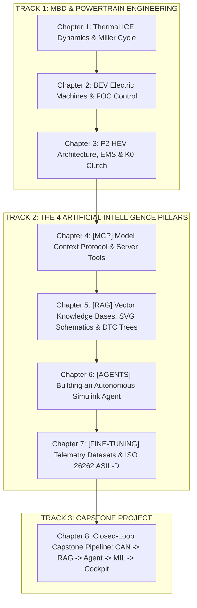

# NexusMBD // Master Curriculum & Course Planner
## AI-Native Powertrain Engineering Suite: Model-Based Design & The 4 AI Pillars

**Author:** Eng. Marley Rosa Luciano | **Program:** NexusMBD AI-Native Powertrain Suite  
**Course Status:** Validated and executable production-grade codebase in repository.  
**Estimated Workload:** 60 Hours (Mathematical Theory, MBD Modeling, MIL Labs & AI Implementation).  
**Target Audience:** Automotive Systems Engineers, Control & Calibration Engineers, Embedded Software Developers & Automotive AI/ML Engineers.

---

## 🎯 Pedagogical Philosophy

**NexusMBD** breaks down the barrier between traditional automotive engineering (**Model-Based Design in MATLAB/Simulink**) and **Frontier Artificial Intelligence**.

The program is engineered so the student is not merely a tool consumer, but **the architect who constructs every component of the cyber-physical ecosystem**:
1. **In the [AGENT] Pillar:** The student builds from scratch an autonomous ReAct Agent capable of launching Simulink, injecting test vectors, and calibrating closed-loop controllers.
2. **In the [RAG] Pillar:** The student connects, indexes, and retrieves mission-critical technical sources (high-voltage workshop manuals, SVG topology schematics, and structured DTC fault trees).
3. **In the [FINE-TUNING] Pillar:** The student creates synthetic physical telemetry datasets, formats domain-specific prompts, and trains models compliant with **ISO 26262 (ASIL-D)**.
4. **In the [MCP] Pillar:** The student implements JSON-RPC servers with robust industrial CAN DBC decoders and 100ms real-time streaming buffers.

---

## 🗺️ Complete Curriculum & Module Map

---

## 📘 Comprehensive Chapter Syllabus

### CHAPTER 1: Thermal ICE Dynamics, Miller Cycle & MBD Architecture
* **Engineering Domain:** Internal Combustion Thermodynamics and Compressible Fluid Mechanics.
* **Core Topics:**
  * The thermodynamic principle of the Miller Cycle with Early Intake Valve Closing (EIVC).
  * Why the Miller Cycle synergizes with P2 Hybrids (low-end torque gap filled by the PMSM).
  * Continuous differential equations for Manifold Absolute Pressure ($P_m$) via the *Speed-Density* method.
  * Brake Specific Fuel Consumption (BSFC) look-up maps and analytical Sweet Spot location ($230\text{ g/kWh} \implies 41\%$ thermal efficiency).
  * Model architectural segregation into 4 MBD Solvers (`COMUNICACAO`, `SOFTECU`, `MDL`, `OUT`).
* **Student Practical Deliverable:** Python validation script (`powertrain_models.py`) evaluating MAP transient response under a 20% to 80% throttle step.

---

### CHAPTER 2: Electrification, PMSM Machines & Field-Oriented Control (FOC)
* **Engineering Domain:** Permanent Magnet Synchronous Machines and Real-Time Vector Control.
* **Core Topics:**
  * Operating principles of Interior Permanent Magnet Synchronous Motors (IPMSM).
  * Power-invariant Clarke ($abc \to \alpha\beta$) and Park ($\alpha\beta \to dq$) transforms.
  * Field-Oriented Control (FOC): Decoupling magnetic flux ($I_d$) from electromagnetic torque ($I_q$).
  * Space Vector Pulse Width Modulation (SVPWM) and high-voltage 3-phase inverter switching.
  * Analytical sizing of PI current loops and anti-windup clamping.
* **Student Practical Deliverable:** MATLAB calibration routine (`export_pmsm_calibration.m`) computing current loop $K_p, K_i$ gains for a $200\text{ A}$ peak at $311\text{ Hz}$.

---

### CHAPTER 3: P2 Hybrid Architecture, EMS Strategy & K0 Clutch
* **Engineering Domain:** Parallel Hybrid Powertrains and Electro-Hydraulic Clutch Actuation.
* **Core Topics:**
  * Kinematics and dynamic coupling of the P2 topology (ICE &rarr; K0 &rarr; PMSM &rarr; e-DCT).
  * State-machine modeling of the 4 K0 clutch states: `OPEN`, `SYNC`, `SLIP`, `LOCKED`.
  * Energy Management Strategy (EMS): Pure EV Mode, Hybrid Boost, Charge-in-Motion, and Regenerative Braking.
  * Dual-clutch e-DCT transmission dynamics (C1 odd gears, C2 even gears).
* **Student Practical Deliverable:** Dynamic hot-start simulation where the PMSM cranks the ICE under controlled K0 slip in $< 250\text{ ms}$ with zero driveline jerk.

---

### CHAPTER 4: [MCP] Model Context Protocol — Building Industrial Server Tools
* **AI Domain:** MCP Architecture, JSON-RPC Protocol, and Real-Time Telemetry Interfaces.
* **Student Autonomous Build:**
  * A full Python MCP server (`mcp_server.py`) using the official `mcp` SDK.
* **Practical Skills Acquired:**
  1. **Industrial CAN DBC Parser:** Script decoding `.dbc` files to extract messages, start bits, lengths, scale factors, offsets, and physical limits.
  2. **Exposed Server Tool Calls:**
     * `read_can_telemetry(channels)`: Streams physical sensor readings at 100ms intervals.
     * `inject_fault_code(ecu_id, dtc)`: Enables LLMs to inject bus faults to test system fail-safes.
     * `set_k0_clutch_target(target_pressure_bar)`: Virtual calibration actuator via JSON-RPC.
  3. **AI Client Integration:** Configured `.vscode/mcp.json` connecting the server to Claude Desktop, Gemini CLI, and Antigravity IDE.
* **Student Practical Deliverable:** Operational MCP server responding to JSON-RPC calls and serving live CAN telemetry to external agents.

---

### CHAPTER 5: [RAG] Retrieval-Augmented Generation — Connecting Authoritative Engineering Sources
* **AI Domain:** Vector Databases, High-Dimensional Embeddings, and Multimodal Semantic Retrieval.
* **Student Autonomous Build:**
  * Technical RAG pipeline ingesting workshop service manuals, component datasheets, and visual schematics.
* **Practical Skills Acquired:**
  1. **Curation & Ingestion of Engineering Documentation:**
     * High-voltage workshop manuals (BMS, Inverter, Traction Motor).
     * Indexing vector SVG schematics (`p2_powertrain_topology.svg`) and Simulink model hierarchies (`simulink_systems.json`).
     * Semantic chunking preserving mathematical equations, pinout tables, and torque envelopes.
  2. **Hybrid Search Engine:**
     * Dense vector similarity (cosine) paired with sparse BM25 (exact alphanumeric matching for DTC codes and calibration symbols).
     * Technical re-ranking prioritizing safety-critical documentation.
  3. **Decision Trees for Critical Automotive Diagnostic Trouble Codes (DTCs):**
     * `P0A80`: Severe High-Voltage Battery Pack Degradation.
     * `P0606`: ECU Internal Microprocessor Integrity Failure (Watchdog timeout).
     * `C0035`: Front-Left Wheel Speed Sensor Plausibility Fault.
     * `P0AA6`: Loss of High-Voltage Galvanic Isolation to Metallic Chassis Ground.
* **Student Practical Deliverable:** Working RAG system answering queries such as *"How to isolate DTC P0AA6 in the P2 inverter?"* with exact pinout diagrams, multimeter step-by-step procedures, and safety standard references.

---

### CHAPTER 6: [AGENTS] Autonomous Simulink Calibration Agents — Building an Agent from Scratch
* **AI Domain:** ReAct Cognitive Loops (Reasoning + Acting), LangGraph/CrewAI, and Automated MIL/SIL Testing.
* **Student Autonomous Build:**
  * An autonomous closed-loop calibration agent controlling MATLAB/Simulink without human intervention.
* **Practical Skills Acquired:**
  1. **ReAct Cognitive Loop Implementation:**
     * Programming the cycle: **Thought** &rarr; **Action (via Tool Call)** &rarr; **Observation** &rarr; **Reflection**.
  2. **MATLAB/Simulink Programmatic API:**
     * Interfacing with `matlab-mcp-core-server` and `Simulink.SimulationInput`.
     * Loading `MIL_MarleyOS_Powertrain.slx`, inspecting model blocks, and writing to the Model Workspace.
  3. **Autonomous Gain Tuning Algorithm:**
     * Objective: *"Eliminate electric torque overshoot (<5%) while keeping rise time under 30ms during tip-in"*.
     * The agent tunes $K_p$ and $K_i$, executes the simulation, parses `logsout`, calculates integral error metrics, and iterates until convergence.
* **Student Practical Deliverable:** Functional Python ReAct agent executing 5 successive MIL runs and generating an optimized calibration table report.

---

### CHAPTER 7: [FINE-TUNING] LLM Domain Specialization & ISO 26262 ASIL-D Alignment
* **AI Domain:** Telemetry Dataset Engineering, Supervised Fine-Tuning (SFT) with LoRA/QLoRA, and Functional Safety.
* **Student Autonomous Build:**
  * A domain-adapted language model specialized in safety-critical automotive systems engineering.
* **Practical Skills Acquired:**
  1. **Telemetry Dataset Engineering:**
     * Synthetic telemetry generator exporting structured JSON Lines (`telemetry_finetune.jsonl`).
     * Contextual instruction-input-output pairs mapping physical sensor readings to certified engineering diagnostics.
  2. **Supervised Fine-Tuning (SFT):**
     * LoRA configuration: rank $r=16$, alpha $\alpha=32$, learning rate schedules, and cross-entropy loss tracking.
     * Fine-tuning open-weights foundation models (Llama 3, Mistral, Gemma).
  3. **Functional Safety Verification (ISO 26262 ASIL-D):**
     * Stress-testing the model against critical vehicle hazard events (unintended acceleration, K0 clutch stuck closed during emergency braking).
     * Hallucination rate benchmarking against Safety Goals and Single Point Fault Metrics (SPFM $\ge 99\%$).
* **Student Practical Deliverable:** Validated `telemetry_finetune.jsonl` dataset and complete training log showing significant diagnostic accuracy gains.

---

### CHAPTER 8: Capstone Project — The Closed End-to-End Autonomous Pipeline
* **Engineering & AI Domain:** Complete Cyber-Physical System Integration.
* **Student Autonomous Build:**
  * A closed-loop architecture where all 4 AI pillars interact dynamically with the powertrain in real time:
    1. **CAN Streaming [MCP]:** 100ms telemetry emitted across the virtual bus.
    2. **Monitoring & Lookup [RAG]:** Inverter temperature anomaly triggers instant semantic retrieval of thermal limits.
    3. **Diagnosis & Calibration [AGENTS]:** ReAct agent triggers a Simulink MIL test to distinguish thermal throttling from PWM failure.
    4. **Safety Audit [FINE-TUNING]:** Domain model audits telemetry and issues a formal ISO 26262 ASIL-D compliance report.
    5. **Cockpit Visualization:** Real-time Web Cockpit reflects diagnostic decisions and mitigation status instantly.
* **Student Practical Deliverable:** End-to-end execution resulting in a fully approved audit report (`capstone_report.txt`).

---

## 🛠️ Competency Matrix & Deliverables

| Pillar / Module | Student Competency | Autonomous Build Deliverable | Technology Stack |
| :--- | :--- | :--- | :--- |
| **Module 1: ICE** | Miller Cycle, MAP, BSFC | Continuous Speed-Density model | Python / NumPy / MATLAB |
| **Module 2: BEV** | FOC, Clarke/Park, Inverter | $I_d/I_q$ current loop calibration | MATLAB MBD / Simulink |
| **Module 3: HEV** | P2 Topology, K0, EMS | K0 slip modulation and e-DCT control | Simulink 4-Mains |
| **Module 4: [MCP]** | JSON-RPC, CAN DBC | **Custom MCP Tool Server** | FastMCP / Python / CAN DBC |
| **Module 5: [RAG]** | Embeddings, Chunking, BM25 | **Hybrid RAG & DTC Fault Trees** | Vector DB / Chroma / KaTeX |
| **Module 6: [AGENTS]** | ReAct Loop, Thought &rarr; Action | **Autonomous Simulink ReAct Agent** | Python / LangGraph / ReAct |
| **Module 7: [FINE-TUNING]**| LoRA, SFT, Technical Prompts | **ISO 26262 ASIL-D Dataset & Model** | PyTorch / HuggingFace / JSONL |
| **Module 8: Capstone** | Integrated Systems Engineering | **Closed End-to-End Pipeline** | Full NexusMBD Suite |

---

## 📅 Course Roadmap

* **Weeks 1 & 2:** MBD Fundamentals, ICE Thermodynamics, BEV & P2 Hybrid Architectures (Modules 1 to 3).
* **Weeks 3 & 4:** The [MCP] Pillar — Constructing the Tool Server & Decoding CAN DBC Telemetry (Module 4).
* **Weeks 5 & 6:** The [RAG] Pillar — Manual Ingestion, Vector SVG Schematics & DTC Diagnostics (Module 5).
* **Weeks 7 & 8:** The [AGENTS] Pillar — Building the Autonomous Simulink Calibration Agent (Module 6).
* **Weeks 9 & 10:** The [FINE-TUNING] Pillar — Dataset Generation & ISO 26262 ASIL-D Tuning (Module 7).
* **Weeks 11 & 12:** Capstone Integration, Real-Time Web Cockpit Validation & Certification Exam (Module 8).
