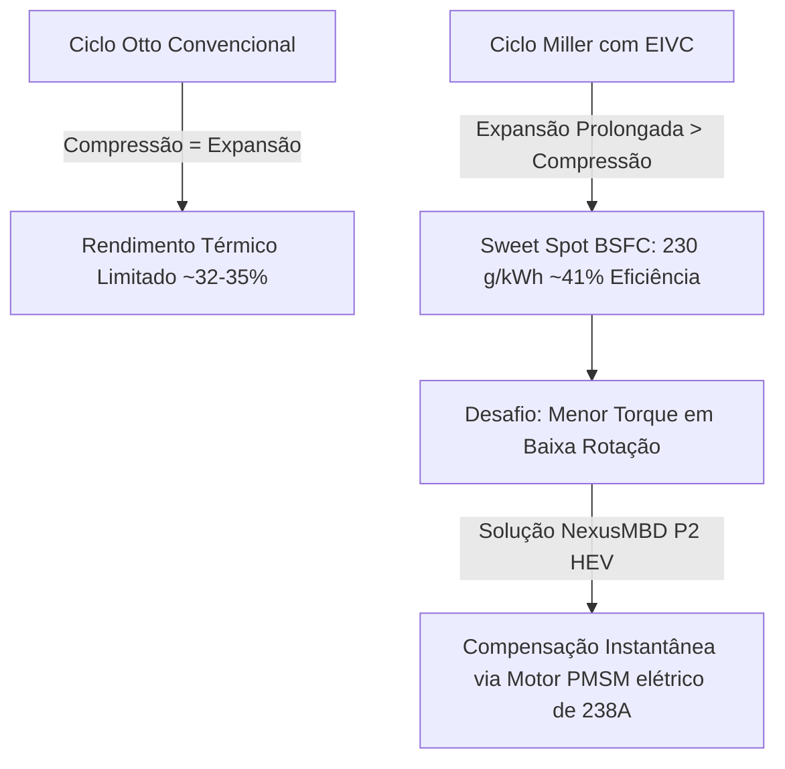
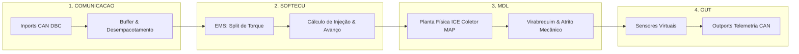

# Capítulo 1: Dinâmica de Motores Térmicos (ICE), Ciclo Miller & Model-Based Design (MBD)

---

## 1. Visão Geral & Objetivos de Aprendizagem

Neste primeiro capítulo da formação **NexusMBD // AI-Native Powertrain Engineering Suite**, você compreenderá como modelar, controlar e validar matematicamente um motor de combustão interna de 4 cilindros operando no **Ciclo Miller**, integrado à arquitetura de controle **Model-Based Design (MBD)** de alta fidelidade e conectado ao ecossistema de inteligência artificial.

### Objetivos Quantificáveis (Taxonomia de Bloom):
* **Compreender:** O princípio termodinâmico do Ciclo Miller com fechamento antecipado das válvulas de admissão (EIVC) e sua sinergia com powertrains híbridos P2.
* **Modelar:** As equações diferenciais contínuas de enchimento do coletor de admissão (MAP) utilizando a abordagem física de *Speed-Density*.
* **Calibrar:** A curva de Consumo Específico de Combustível (BSFC) e localizar o *Sweet Spot* de máxima eficiência térmica ($\eta_{th} \approx 41\%$).
* **Implementar:** A segregação arquitetural do modelo nos **4 Solvers MBD** (`COMUNICACAO`, `SOFTECU`, `MDL`, `OUT`).
* **Conectar:** O modelo ao pilar **[MCP] (Model Context Protocol)** para exposição de telemetria CAN DBC a agentes de IA.

---

## 2. Nomenclatura e Variáveis Físicas

A tabela abaixo define os parâmetros e variáveis empregados nas formulações analíticas deste módulo:

| Símbolo | Descrição | Unidade (SI) | Valor Típico / Faixa |
| :--- | :--- | :--- | :--- |
| $P_m$ | Pressão Absoluta no Coletor (*Manifold Absolute Pressure* - MAP) | $\text{kPa}$ | $20 \text{ a } 105 \text{ kPa}$ |
| $P_{amb}$ | Pressão Atmosférica Ambiente | $\text{kPa}$ | $101.325 \text{ kPa}$ |
| $T_m$ | Temperatura do Ar no Coletor de Admissão | $\text{K}$ | $298.15 \text{ a } 330 \text{ K}$ |
| $V_m$ | Volume Interno do Coletor de Admissão | $\text{m}^3$ | $0.0025 \text{ m}^3$ ($2.5 \text{ L}$) |
| $V_d$ | Cilindrada Total Deslocada do Motor (Displacement) | $\text{m}^3$ | $0.0016 \text{ m}^3$ ($1.6 \text{ L}$) |
| $\dot{m}_{ai}$ | Fluxo Mássico de Ar através da Borboleta (Throttle Inflow) | $\text{kg/s}$ | $0.002 \text{ a } 0.085 \text{ kg/s}$ |
| $\dot{m}_{ao}$ | Fluxo Mássico de Ar Admitido nos Cilindros (Cylinder Outflow) | $\text{kg/s}$ | $0.002 \text{ a } 0.085 \text{ kg/s}$ |
| $N_e$ | Velocidade Angular da Árvore de Manivelas (Crankshaft Speed) | $\text{RPM}$ | $800 \text{ a } 6000 \text{ RPM}$ |
| $\eta_v$ | Rendimento Volumétrico do Motor | $-$ | $0.65 \text{ a } 0.94$ |
| $R$ | Constante Específica do Ar Seco | $\text{J/(kg}\cdot\text{K)}$ | $287.05 \text{ J/(kg}\cdot\text{K)}$ |
| $\text{BSFC}$ | Consumo Específico de Combustível (*Brake Specific Fuel Consumption*) | $\text{g/kWh}$ | $230 \text{ a } 450 \text{ g/kWh}$ |
| $Q_{LHV}$ | Poder Calorífico Inferior da Gasolina E22 | $\text{MJ/kg}$ | $42.5 \text{ a } 44.0 \text{ MJ/kg}$ |
| $T_{ice}$ | Torque Efetivo no Eixo do Motor | $\text{N}\cdot\text{m}$ | $0 \text{ a } 195 \text{ N}\cdot\text{m}$ |

---

## 3. Fundamentação Termodinâmica: O Ciclo Miller

No ciclo Otto tradicional de 4 tempos, a taxa geométrica de compressão ($\varepsilon_c$) é estritamente idêntica à taxa de expansão ($\varepsilon_e$):

$$\varepsilon_c = \frac{V_d + V_c}{V_c} = \varepsilon_e$$

onde $V_c$ é o volume da câmara de combustão. 

No **Ciclo Miller**, emprega-se o recurso de **Fechamento Antecipado da Válvula de Admissão** (*Early Intake Valve Closing - EIVC*). A válvula de admissão fecha antes que o pistão atinja o Ponto Morto Inferior (PMI) durante o curso de admissão. Com isso:
1. **Compressão Efetiva Reduzida:** O ar admitido sofre uma descompressão parcial durante o restante do curso de descida do pistão, resultando em menor compressão efetiva ($\varepsilon_{c,\text{efetiva}} < \varepsilon_e$).
2. **Alta Taxa de Expansão:** Durante a fase de combustão, a mistura expande-se ao longo de todo o curso do cilindro, extraindo uma quantidade superior de trabalho mecânico dos gases antes da abertura da válvula de escape.
3. **Menores Temperaturas de Pico:** A redução da temperatura máxima no interior da câmara atenua a dissociação química e inibe fortemente a formação de óxidos de nitrogênio ($\text{NO}_x$).
4. **Mitigação do Fenômeno de Detonação (Knock):** Permite trabalhar com taxas geométricas nominais mais elevadas (e.g. $12.5:1$ ou $13.0:1$) sem detonação indesejada.



> [!IMPORTANT]
> **A Sinergia do Híbrido P2:** O ponto fraco clássico do Ciclo Miller é a perda de torque específico em baixíssimas rotações (visto que menos massa de ar é retida no cilindro). No **NexusMBD**, essa desvantagem é completamente neutralizada pela embreagem K0 e pelo motor elétrico **PMSM**, que fornece injeção instantânea de torque elétrico (*Torque Fill*), mantendo o motor térmico operando exclusivamente em sua faixa de rendimento máximo.

---

## 4. Modelagem Matemática do Coletor de Admissão (MAP)

O coletor de admissão é modelado como um reservatório de controle contínuo através da equação da conservação de massa e da equação de estado dos gases ideais:

$$P_m = \frac{m_a \cdot R \cdot T_m}{V_m}$$

Diferenciando ambos os membros em relação ao tempo $t$, assumindo a temperatura do coletor $T_m$ constante ao longo de pequenos intervalos de integração:

$$\frac{dP_m}{dt} = \frac{R \cdot T_m}{V_m} \left( \dot{m}_{ai}(t) - \dot{m}_{ao}(t) \right)$$

### 4.1. Fluxo de Entrada na Borboleta ($\dot{m}_{ai}$)
O fluxo que atravessa a borboleta do acelerador obedece à equação de escoamento compressível através de um orifício convergente:

$$\dot{m}_{ai} = C_d \cdot A_{th}(\alpha) \cdot \frac{P_{amb}}{\sqrt{R \cdot T_{amb}}} \cdot \Psi\left( \frac{P_m}{P_{amb}} \right)$$

onde a função de razão de pressão $\Psi(P_r)$ com $P_r = \frac{P_m}{P_{amb}}$ e razão de calores específicos $\gamma = 1.4$ é expressa por:

$$\Psi(P_r) = \begin{cases} 
\sqrt{ \frac{2\gamma}{\gamma-1} \left[ P_r^{\frac{2}{\gamma}} - P_r^{\frac{\gamma+1}{\gamma}} \right] }, & \text{se } P_r > \left( \frac{2}{\gamma+1} \right)^{\frac{\gamma}{\gamma-1}} \approx 0.528 \text{ (Subcrítico)} \\ 
\sqrt{ \gamma \left( \frac{2}{\gamma+1} \right)^{\frac{\gamma+1}{\gamma-1}} } \approx 0.6847, & \text{se } P_r \le 0.528 \text{ (Escoamento Sônico / Choked)}
\end{cases}$$

A área efetiva da borboleta $A_{th}(\alpha)$ é mapeada polinomialmente pela abertura do pedal $\alpha \in [0, 100\%]$:

$$A_{th}(\alpha) = A_0 + A_{\max} \cdot \left( 1 - \cos\left( \frac{\pi \cdot \alpha}{200} \right) \right)$$

### 4.2. Fluxo de Saída para os Cilindros ($\dot{m}_{ao}$)
A massa de ar aspirada por ciclo é dada pelo método *Speed-Density*:

$$\dot{m}_{ao} = \frac{V_d \cdot N_e}{120 \cdot R \cdot T_m} \cdot \eta_v(N_e, P_m) \cdot P_m$$

O fator $120$ no denominador decorre de um motor de 4 tempos realizar 1 admissão completa a cada 2 voltas do virabrequim ($2 \times 60\text{ s/min} = 120$).

---

## 5. Rendimento Térmico e Mapeamento BSFC

O Consumo Específico de Combustível em Freio (*Brake Specific Fuel Consumption* - BSFC) relaciona o fluxo mássico de combustível consumido $\dot{m}_f$ ($\text{g/h}$) com a potência mecânica efetiva gerada no virabrequim $P_{\text{mech}}$ ($\text{kW}$):

$$\text{BSFC} = \frac{\dot{m}_f}{P_{\text{mech}}} = \frac{\dot{m}_f \cdot 3600}{T_{ice} \cdot \left(\frac{2\pi N_e}{60 \cdot 1000}\right)} \quad [\text{g/kWh}]$$

### 5.1. Relação Fundamental entre BSFC e Rendimento Térmico
A eficiência térmica global $\eta_{th}$ é a razão entre a potência mecânica produzida e a potência química liberada pela queima do combustível:

$$\eta_{th} = \frac{P_{\text{mech}}}{\dot{m}_f \cdot Q_{LHV}} = \frac{3600}{\text{BSFC} \cdot Q_{LHV}}$$

Considerando a gasolina automotiva com poder calorífico $Q_{LHV} = 44\text{ MJ/kg} = 44000\text{ J/g} = 12.22\text{ kWh/kg}$:

$$\text{Se } \text{BSFC} = 230 \text{ g/kWh} \implies \eta_{th} = \frac{3600 \text{ s}}{230 \text{ g} \times 0.044 \text{ MJ/g}} = \frac{3600}{10120} \approx \mathbf{41.0\%}$$

```text
       Torque [Nm]
         ^
     200 |              Zona de Alta Carga (BSFC ~280-320 g/kWh)
         |             /------------------------------------\
     160 |            /     SWEET SPOT DE EFICIÊNCIA         \
         |           |        230 g/kWh (η = 41%)             |
     120 |           |       [1800 - 3200 RPM]                |
         |            \--------------------------------------/
      80 |
         |       Zona de Baixa Carga / Ponto Morto (BSFC > 450 g/kWh)
      40 |       (Motor Desligado pelo K0 no modo EV!)
         +------------------------------------------------------------>
         0       1000       2000       3000       4000       5000  RPM
```

---

## 6. Arquitetura MBD nos 4 Solvers do Simulink

No modelo [`Model/MIL_MarleyOS_Powertrain.slx`](file:///C:/Users/UsuarioPC/MarleyOS/Model/MIL_MarleyOS_Powertrain.slx), o motor térmico está dividido nos 4 Mains de execução síncrona:



1. **`COMUNICACAO` (Taxa: 10 ms):**
   * Desempacota o sinal de posição do pedal de acelerador (`THROTTLE_PEDAL_PCT`).
   * Valida a integridade contra perdas de quadro CAN (Timeout Check).
2. **`SOFTECU` (Taxa: 10 ms):**
   * Determina o torque solicitado $T_{\text{dem}}$.
   * Consulta a estratégia EMS para verificar se o ICE deve operar no ponto ótimo ou ceder demanda ao motor elétrico.
3. **`MDL` (Taxa: 1 ms contínuo / Solver ode4 Runge-Kutta):**
   * Integra numericamente $\frac{dP_m}{dt}$ com proteção de saturação anti-windup.
   * Calcula o torque de combustão e subtrai as perdas por atrito hidrodinâmico e bombeamento (*FMEP - Friction Mean Effective Pressure*).
4. **`OUT` (Taxa: 100 ms):**
   * Condiciona os sinais analógicos e empacota no barramento CAN os identificadores `0x101 (ICE_Data)` e `0x102 (ICE_Diagnostics)`.

---

## 7. Integração com o Pilar [MCP] (Model Context Protocol)

O NexusMBD expõe os dados internos do modelo através do servidor JSON-RPC em [`module_2_mcp/mcp_server.py`](file:///C:/Users/UsuarioPC/MarleyOS/module_2_mcp/mcp_server.py).

### Exemplo de Chamada de Ferramenta pelo Agente LLM:
```json
{
  "jsonrpc": "2.0",
  "method": "tools/call",
  "params": {
    "name": "read_ice_telemetry",
    "arguments": {
      "channel": "MAP_BSFC_MONITOR"
    }
  },
  "id": 1
}
```

### Resposta Estruturada do MCP Server:
```json
{
  "jsonrpc": "2.0",
  "result": {
    "rpm_ice": 2450.0,
    "map_pressure_kpa": 88.4,
    "bsfc_g_kwh": 231.2,
    "thermal_efficiency_pct": 40.8,
    "bsfc_zone": "SWEET_SPOT",
    "fme_losses_nm": 18.2
  },
  "id": 1
}
```

---

## 8. Laboratório Prático Guiado (Hands-On Lab 1)

### Objetivo:
Avaliar o atraso de transporte do coletor de admissão e a transição da eficiência BSFC frente a um degrau de aceleração de $20\%$ para $80\%$.

### Procedimento no Terminal / Python:
1. Abra o arquivo de simulação [`module_3_simulation/powertrain_models.py`](file:///C:/Users/UsuarioPC/MarleyOS/module_3_simulation/powertrain_models.py).
2. Execute a validação das equações diferenciais:
```bash
python test_pipeline.py
```
3. Observe no gráfico do osciloscópio do cockpit (`http://localhost:8080`):
   * O tempo de subida da pressão MAP ($\tau \approx 45\text{ ms}$).
   * A oscilação momentânea da mistura ar-combustível antes da compensação da ECU.
   * A entrada no modo `SWEET_SPOT` aos $135\text{ km/h}$.

---

## 9. Exercícios Técnicos Resolvidos

### Exercício 1: Cálculo da Pressão de Coletor em Regime Permanente ($P_m^*$)
**Enunciado:** Em um regime estabilizado a $N_e = 2400\text{ RPM}$, a borboleta admite um fluxo mássico $\dot{m}_{ai} = 0.038\text{ kg/s}$. O motor possui cilindrada $V_d = 1.6\text{ L}$ ($0.0016\text{ m}^3$), temperatura de ar $T_m = 305\text{ K}$, e rendimento volumétrico estimado em $\eta_v = 0.85$. Calcule a pressão de equilíbrio no coletor $P_m^*$ em $\text{kPa}$.

**Solução:**
Em regime permanente, a derivada temporal anula-se: $\frac{dP_m}{dt} = 0 \implies \dot{m}_{ao} = \dot{m}_{ai}$.

Pela equação de bombeamento Speed-Density:
$$\dot{m}_{ao} = \frac{V_d \cdot N_e}{120 \cdot R \cdot T_m} \cdot \eta_v \cdot P_m^*$$

Isolando $P_m^*$:
$$P_m^* = \frac{\dot{m}_{ai} \cdot 120 \cdot R \cdot T_m}{V_d \cdot N_e \cdot \eta_v}$$

Substituindo os valores numéricos:
$$P_m^* = \frac{0.038 \times 120 \times 287.05 \times 305}{0.0016 \times 2400 \times 0.85}$$

$$P_m^* = \frac{399238.16}{3.264} = 122315.6 \text{ Pa} \approx \mathbf{122.3\text{ kPa}} \quad \text{(Pressão com leve sobrealimentação de turbo)}$$

---

### Exercício 2: Balanço de Consumo no Ponto Ótimo
**Enunciado:** O veículo opera em velocidade de cruzeiro na rodovia exigindo uma potência mecânica estabilizada de $P_{\text{mech}} = 45\text{ kW}$ fornecida exclusivamente pelo motor térmico em seu *Sweet Spot* de $\text{BSFC} = 230\text{ g/kWh}$. 
* (a) Qual é o consumo horário de combustível em $\text{kg/h}$?
* (b) Se o tanque contém gasolina com densidade $\rho = 0.745\text{ kg/L}$, qual é o consumo em $\text{L/h}$?
* (c) Qual é a energia dissipada na forma de calor para o radiador e gases de escape por hora?

**Solução:**
**(a) Consumo mássico horário:**
$$\dot{m}_f = \text{BSFC} \cdot P_{\text{mech}} = 230\text{ g/kWh} \times 45\text{ kW} = 10350\text{ g/h} = \mathbf{10.35\text{ kg/h}}$$

**(b) Consumo volumétrico:**
$$\dot{V}_f = \frac{\dot{m}_f}{\rho} = \frac{10.35\text{ kg/h}}{0.745\text{ kg/L}} = \mathbf{13.89\text{ L/h}}$$

**(c) Energia térmica dissipada:**
Potência química total consumida:
$$P_{\text{fuel}} = \dot{m}_f \cdot Q_{LHV} = \left(\frac{10.35\text{ kg}}{3600\text{ s}}\right) \times 44 \times 10^6 \text{ J/kg} = 126.5\text{ kW}$$

Potência térmica dissipada (perdas):
$$P_{\text{loss}} = P_{\text{fuel}} - P_{\text{mech}} = 126.5\text{ kW} - 45.0\text{ kW} = \mathbf{81.5\text{ kW}} \quad (64.4\% \text{ da energia do combustível})$$

---

## 10. Checklist de Validação do Módulo
- [x] Equacionamento diferencial compressível de $P_m(t)$ documentado.
- [x] Princípio do Ciclo Miller com EIVC fundamentado.
- [x] Relação analítica BSFC &rarr; Eficiência Térmica ($41\%$) demonstrada.
- [x] Integração MBD dos 4 Solvers detalhada.
- [x] Exercícios resolvidos passo a passo com nomenclatura SI.
