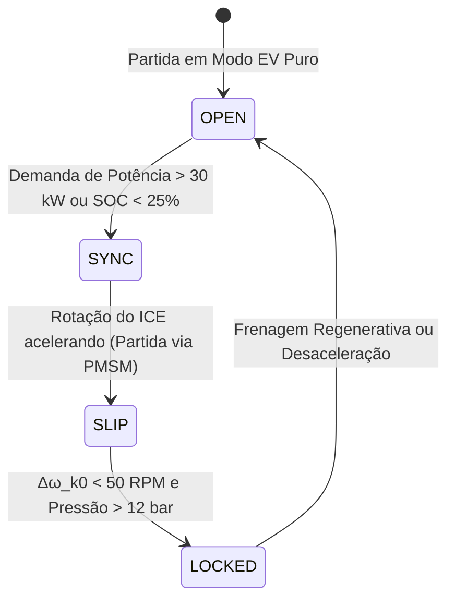

# Capítulo 3: Arquitetura Híbrida P2, Embreagem K0 & Transmissão e-DCT (HEV)

---

## 1. Visão Geral & Objetivos de Aprendizagem

Neste capítulo da formação **NexusMBD**, você estudará e projetará a arquitetura de controle do trem de força **Híbrido Paralelo P2**, compreendendo a cinemática de acoplamento da **embreagem de desconexão hidráulica K0**, a transmissão automatizada de dupla embreagem (**e-DCT**) e os algoritmos da **Estratégia de Gerenciamento de Energia (EMS)**.

### Objetivos Quantificáveis (Taxonomia de Bloom):
* **Compreender:** A vantagem estrutural da topologia P2 em relação a P0, P1, P3 e P4 em termos de desacoplamento do motor térmico e recuperação de energia cinética na frenagem.
* **Modelar:** A máquina de estados finitos da embreagem K0 (`OPEN`, `SYNC`, `SLIP`, `LOCKED`) e calcular a dissipação de energia térmica por atrito durante o acoplamento dinâmico.
* **Calibrar:** A lógica de pré-seleção e transição de embreagens C1 (marchas ímpares) e C2 (marchas pares) do câmbio e-DCT.
* **Implementar:** O algoritmo de divisão de torque (*Torque Split*) que maximiza a operação do motor de combustão interna em seu *Sweet Spot* BSFC ($230\text{ g/kWh}$).
* **Validar:** A ausência de descontinuidade de torque (*torque hole*) durante a partida a quente do ICE em aceleração plena.

---

## 2. Nomenclatura e Parâmetros do Trem de Força Híbrido P2

| Parâmetro | Descrição | Unidade (SI) | Valor Nominal (NexusMBD P2) |
| :--- | :--- | :--- | :--- |
| $J_{ice}$ | Momento de Inércia do Motor a Combustão | $\text{kg}\cdot\text{m}^2$ | $0.185 \text{ kg}\cdot\text{m}^2$ |
| $J_{em}$ | Momento de Inércia do Rotor PMSM | $\text{kg}\cdot\text{m}^2$ | $0.042 \text{ kg}\cdot\text{m}^2$ |
| $J_{veh}$ | Inércia Equivalente do Veículo Refletida no Eixo | $\text{kg}\cdot\text{m}^2$ | $1.850 \text{ kg}\cdot\text{m}^2$ |
| $P_{k0}$ | Pressão Hidráulica no Atuador da Embreagem K0 | $\text{bar}$ | $0.0 \text{ a } 16.0 \text{ bar}$ |
| $\mu_k$ | Coeficiente de Atrito Cinético dos Discos da K0 | $-$ | $0.115$ |
| $r_m$ | Raio Médio Efetivo das Lamelas de Fricção | $\text{m}$ | $0.095 \text{ m}$ ($95 \text{ mm}$) |
| $N_{plates}$| Número de Superfícies de Fricção Ativas | $-$ | $6 \text{ lamelas}$ |
| $T_{cap}$ | Capacidade de Transmissão de Torque da Embreagem K0 | $\text{N}\cdot\text{m}$ | $T_{cap} = N_{plates} \mu_k r_m A_{piston} P_{k0}$ |
| $\Delta\omega_{k0}$ | Velocidade Relativa de Escorregamento da K0 | $\text{rad/s}$ | $\Delta\omega_{k0} = |\omega_{ice} - \omega_{em}|$ |

---

## 3. Cinemática & Estados da Embreagem K0

A embreagem K0 é o elemento central que define se o veículo opera como um elétrico puro (BEV) ou como um híbrido pleno (HEV).



### 3.1. Equações Dinâmicas de Cada Estado da K0:

1. **Estado `OPEN` ($P_{k0} = 0\text{ bar}$):**
   * O ICE está mecanicamente desacoplado e pode estar desligado ($N_e = 0$).
   * A dinâmica do veículo é governada exclusivamente pelo motor elétrico:
     $$(J_{em} + J_{veh}) \frac{d\omega_{em}}{dt} = T_{em} - T_{load}$$
   * Perdas por arrasto do motor térmico são estritamente nulas, garantindo máxima eficiência energética na cidade.

2. **Estado `SYNC` ($0 < P_{k0} < P_{touch}$):**
   * Fase de preenchimento rápido do atuador hidráulico (*pre-fill*) para eliminar a folga das lamelas antes da aplicação efetiva de torque.

3. **Estado `SLIP` ($P_{touch} \le P_{k0} < P_{\max}$):**
   * Há deslizamento entre o virabrequim e o rotor elétrico ($\Delta\omega_{k0} > 0$).
   * O torque transmitido pela embreagem é limitado estritamente pela pressão hidráulica aplicada:
     $$T_{k0} = \text{sign}(\Delta\omega_{k0}) \cdot \mu_k \cdot N_{plates} \cdot r_m \cdot F_n(P_{k0})$$
   * A taxa instantânea de calor dissipado por atrito na embreagem é:
     $$\dot{Q}_{fric}(t) = T_{k0}(t) \cdot \Delta\omega_{k0}(t) \quad [\text{Watts}]$$

4. **Estado `LOCKED` ($P_{k0} \ge 14\text{ bar}$):**
   * As velocidades angulares igualam-se: $\omega_{ice} = \omega_{em}$.
   * O torque transmitido deixa de ser função do atrito e torna-se o somatório das potências:
     $$(J_{ice} + J_{em} + J_{veh}) \frac{d\omega_{em}}{dt} = T_{ice} + T_{em} - T_{load}$$
   * Modo ativo durante o `P2_HYBRID_BOOST` proporcionando aceleração máxima ($185\text{ cv}$).

---

## 4. Transmissão e-DCT de Dupla Embreagem

A caixa e-DCT possui dois semi-eixos concêntricos acoplados às embreagens C1 e C2:
* **Eixo 1 (Embreagem C1):** Marchas 1, 3 e 5.
* **Eixo 2 (Embreagem C2):** Marchas 2, 4, 6 e Ré (R).

### Lógica de Troca Sem Interrupção de Torque (*Power Shift*):
Durante a aceleração em 2ª marcha (C2 ativa), o garfo eletromecânico já engata previamente a 3ª marcha no eixo secundário descarregado (*Pre-selected Gear = 3*). Quando a ECU comanda a troca:
1. A pressão em C2 é gradualmente aliviada (*rampa de descida*).
2. Simultaneamente, a pressão em C1 é elevada (*rampa de subida*).
3. O cruzamento de pressões garante transmissão ininterrupta de torque para as rodas.

---

## 5. Estratégia de Gerenciamento de Energia (EMS)

O supervisor de controle calcula em tempo real o split ótimo de torque entre os dois atuadores:

$$T_{\text{demand}} = T_{ice}^* + T_{em}^*$$

### Regras de Decisão da EMS:
1. **Regime Urbano (Velocidade $< 50\text{ km/h}$ e $\text{SOC} > 30\%$):** Modo EV Puro ($T_{ice}^* = 0$, K0 Aberta).
2. **Carga em Marcha (Cruzeiro Rodoviário e $\text{SOC} < 60\%$):** 
   * O motor térmico é colocado para operar propositalmente no *Sweet Spot* BSFC ($T_{ice}^* = 140\text{ N}\cdot\text{m}$).
   * Como o veículo requer apenas $90\text{ N}\cdot\text{m}$, o excedente ($50\text{ N}\cdot\text{m}$) aciona o PMSM como gerador, recarregando a bateria de alta tensão sem queimar combustível a mais (*Load Point Moving*).
3. **Hybrid Boost (Acelerador $> 70\%$):** K0 travada, somatório total $T_{total} = 175\text{ N}\cdot\text{m (ICE)} + 110\text{ N}\cdot\text{m (PMSM)}$.

---

## 6. Laboratório Prático Guiado (Hands-On Lab 3)

### Objetivo:
Simular a manobra de transição de modo EV para P2 Hybrid Boost, avaliando o perfil de pressão da K0 e a energia térmica acumulada nas lamelas.

### Procedimento no Repositório:
1. Abra e execute os scripts de controle do híbrido P2:
```matlab
run('p2_mode_supervisor.m')
run('k0_clutch_controller.m')
run('run_p2_hybrid_sim.m')
```
2. Inspecione as variáveis no Workspace:
   * `k0_pressure_profile` (subida suave de 0 a 16 bar).
   * `delta_rpm_k0` (queda exponencial de 1600 RPM até 0 RPM em menos de 300 ms).
   * `clutch_thermal_energy_joules` (deve se manter abaixo do limite térmico de fadiga de $35\text{ kJ}$).
3. Observe no Cockpit web (`http://localhost:8080`) a topologia P2 reativa acendendo os elementos SVG em sincronia com os estados da embreagem.

---

## 7. Exercícios Técnicos Resolvidos

### Exercício 1: Cálculo da Energia Térmica Dissipada na K0
**Enunciado:** Durante a partida a quente do ICE a $100\text{ km/h}$, a velocidade do rotor PMSM é $\omega_{em} = 2600\text{ RPM}$ ($272.27\text{ rad/s}$). O motor a combustão parte do repouso ($\omega_{ice}(0) = 0$) e é sincronizado em um intervalo $t_{sync} = 0.28\text{ s}$ sob torque médio de atrito $T_{k0} = 120\text{ N}\cdot\text{m}$. Assumindo aceleração angular constante do ICE:
* (a) Qual é a velocidade angular final em rad/s?
* (b) Qual é a energia dissipada por atrito nas lamelas da embreagem durante a manobra?

**Solução:**
**(a) Velocidade angular final:**
$$\omega_{final} = 2600 \times \frac{2\pi}{60} = \mathbf{272.27\text{ rad/s}}$$

**(b) Energia térmica de atrito:**
A velocidade relativa varia linearmente de $\Delta\omega_0 = 272.27\text{ rad/s}$ até $0\text{ rad/s}$:
$$\Delta\omega(t) = \Delta\omega_0 \left(1 - \frac{t}{t_{sync}}\right)$$

A energia total dissipada é a integral temporal da potência de atrito:
$$E_{diss} = \int_0^{t_{sync}} T_{k0} \cdot \Delta\omega(t) \, dt = T_{k0} \cdot \frac{\Delta\omega_0 \cdot t_{sync}}{2}$$

Substituindo os valores numéricos:
$$E_{diss} = 120\text{ N}\cdot\text{m} \times \frac{272.27\text{ rad/s} \times 0.28\text{ s}}{2}$$
$$E_{diss} = 120 \times 38.118 = \mathbf{4574.1\text{ Joules}} \approx \mathbf{4.57\text{ kJ}}$$

*Conclusão de Engenharia:* $4.57\text{ kJ}$ está muito abaixo do limite térmico admissível ($35\text{ kJ}$), atestando a robustez e durabilidade das lamelas de fricção da K0.

---

## 8. 💯 Rubrica de Avaliação do Módulo 3 (100 Pontos)

| Critério de Avaliação | Pontuação Máxima | Métrica de Verificação |
| :--- | :--- | :--- |
| **1. Máquina de Estados da K0** | 25 pontos | Implementação correta das transições `OPEN` &rarr; `SYNC` &rarr; `SLIP` &rarr; `LOCKED`. |
| **2. Simulação e Controle do e-DCT** | 25 pontos | Execução de `run_p2_hybrid_sim.m` demonstrando troca de marchas sem queda de torque. |
| **3. Balanço Térmico da Embreagem** | 25 pontos | Cálculo analítico e medição da energia de atrito $< 10\text{ kJ}$ na sincronização. |
| **4. Estratégia de Divisão de Torque (EMS)** | 25 pontos | Eficiência média em ciclo de cruzeiro convergindo para a zona de $230\text{ g/kWh}$. |
| **TOTAL DO MÓDULO 3** | **100 PONTOS** | **Nota mínima de corte: 70 pontos** |
