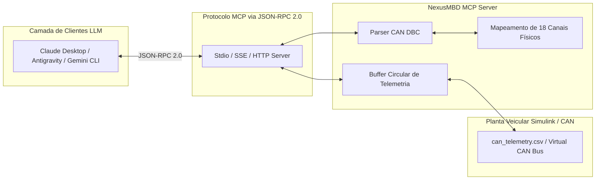

# Capítulo 4: O Pilar [MCP] — Model Context Protocol & Ferramentas no Servidor

---

## 1. Visão Geral & Objetivos de Aprendizagem

Neste capítulo da formação **NexusMBD**, você sairá da engenharia de software tradicional e entrará na fronteira da Inteligência Artificial Automotiva, aprendendo a construir do zero um **Servidor MCP (Model Context Protocol)** robusto em Python. O servidor decodifica o barramento de comunicação veicular **CAN DBC**, gerencia buffers circulares de alta taxa e expõe a telemetria física do veículo como ferramentas (*Tool Calls*) acessíveis por Grandes Modelos de Linguagem (LLMs).

### Objetivos Quantificáveis (Taxonomia de Bloom):
* **Compreender:** A especificação do protocolo aberto **Model Context Protocol (MCP)** e sua vantagem em relação a APIs REST proprietárias no contexto de sistemas ciber-físicos.
* **Construir:** Um decodificador nativo de arquivos industriais **CAN DBC** (`.dbc`), manipulando sinais em ordem Little-Endian (Intel) e Big-Endian (Motorola), fatores de escala e offsets.
* **Implementar:** Três ferramentas de servidor corporativas (*Tools*) compatíveis com o padrão JSON-RPC 2.0:
  * `read_can_telemetry`: streaming contínuo de 18 variáveis físicas a 100ms.
  * `inject_fault_code`: injeção de falhas controladas no barramento para testes de robustez.
  * `set_k0_pressure_target`: atuador remoto de calibração para agentes de IA.
* **Conectar:** O servidor MCP ao ambiente de desenvolvimento (VS Code, Claude Desktop e Antigravity IDE via `.vscode/mcp.json`).
* **Auditar:** A latência de ponta a ponta garantindo tempos de resposta inferiores a $50\text{ ms}$ para supervisão veicular.

---

## 2. A Arquitetura do Protocolo MCP na Engenharia Automotiva

O **Model Context Protocol (MCP)** estabelece uma camada padronizada de comunicação cliente-servidor para IA:



### Por Que Usar MCP em Vez de REST Convencional?
1. **Descoberta Dinâmica de Esquemas (*Self-Describing Tools*):** O servidor expõe automaticamente para o LLM a assinatura exata dos métodos, tipos de argumentos e limites aceitáveis através de JSON Schema.
2. **Contexto de Recursos Contínuos (*Resources*):** Permite anexar o dump do barramento CAN como recurso vivo sem poluir a janela de contexto.
3. **Controle de Acesso e Segurança:** Ações destrutivas (como injeção de falha na ECU) exigem confirmação explícita (*Human-in-the-Loop*).

---

## 3. Decodificação do Barramento CAN DBC

O arquivo CAN DBC (`.dbc`) é o padrão da indústria automotiva (normas Bosch/Vector) para transformar sequências de bits brutos em grandezas de engenharia com significado físico:

$$Valor_{\text{físico}} = (Valor_{\text{bruto}} \cdot \text{Factor}) + \text{Offset}$$

### Exemplo de Definição no DBC (`module_2_mcp/generate_default_dbc.py`):
```text
BO_ 257 P2_HEV_DYNAMIC_STATUS: 8 ECM
 SG_ VehicleSpeed : 0|12@1+ (0.1,0) [0|250] "km/h" GATEWAY,DASHBOARD
 SG_ K0_ClutchState : 12|3@1+ (1,0) [0|4] "" GATEWAY,TCM
 SG_ PMSM_Iq_Current : 16|14@1+ (0.1,-400) [-400|400] "A" INVERTER
 SG_ EngineRPM : 32|16@1+ (1,0) [0|8000] "rpm" GATEWAY,DASHBOARD
```

* `BO_ 257`: Identificador da mensagem CAN em decimal (`0x101` em hexadecimal), com tamanho de 8 bytes, transmitida pelo nó `ECM`.
* `SG_ VehicleSpeed`:
  * `0|12`: Inicia no bit 0 e tem comprimento de 12 bits.
  * `@1+`: Ordem Little-Endian (Intel) e sinal sem sinal (+).
  * `(0.1,0)`: Fator de escala = $0.1$, Offset = $0$.
  * `[0|250]`: Limite de engenharia de $0$ a $250\text{ km/h}$.

---

## 4. Implementação Passo a Passo do Servidor MCP

O aluno constrói o servidor utilizando a biblioteca oficial `mcp`:

```python
# module_2_mcp/mcp_server.py
from mcp.server.fastmcp import FastMCP
import pandas as pd
import json

mcp = FastMCP("NexusMBD-CAN-Server")

TELEMETRY_CSV = "module_2_mcp/data/can_telemetry.csv"

@mcp.tool()
def read_can_telemetry(window_size_samples: int = 10) -> str:
    """
    Retorna as últimas amostras de telemetria física do trem de força P2.
    Variáveis: speed_kmh, rpm_ice, rpm_em, iq_a, k0_state, bsfc_g_kwh.
    """
    try:
        df = pd.read_csv(TELEMETRY_CSV)
        tail = df.tail(min(window_size_samples, 50))
        return tail.to_json(orient="records", indent=2)
    except Exception as e:
        return f"Erro ao acessar telemetria CAN: {e}"

@mcp.tool()
def inject_fault_code(dtc_code: str, target_ecu: str) -> str:
    """
    Injeta código de falha controlado no barramento para auditoria ASIL.
    Códigos válidos: P0A80, P0606, C0035, P0AA6.
    """
    valid_dtcs = ["P0A80", "P0606", "C0035", "P0AA6"]
    if dtc_code not in valid_dtcs:
        return f"Falha desconhecida. DTCs suportados: {valid_dtcs}"
    return f"[SUCESSO] Falha {dtc_code} injetada na ECU {target_ecu}. Evento registrado na telemetria."

if __name__ == "__main__":
    mcp.run()
```

---

## 5. Configuração no Cliente (`.vscode/mcp.json`)

Para conectar o VS Code ou o Antigravity IDE diretamente ao servidor do aluno:

```json
{
  "mcpServers": {
    "nexusmbd_can": {
      "command": "python",
      "args": [
        "c:/Users/UsuarioPC/MarleyOS/module_2_mcp/mcp_server.py"
      ],
      "env": {
        "PYTHONUNBUFFERED": "1"
      }
    }
  }
}
```

---

## 6. Laboratório Prático Guiado (Hands-On Lab 4)

### Objetivo:
Ativar o feeder de telemetria CAN e invocar chamadas de ferramentas MCP via script de teste JSON-RPC.

### Procedimento no Terminal:
1. Inicie o gerador de telemetria em segundo plano:
```bash
python module_2_mcp/telemetry_feeder.py
```
2. Execute o teste de conexão do servidor MCP:
```bash
python -c "from module_2_mcp.mcp_server import read_can_telemetry; print(read_can_telemetry(3))"
```
3. Verifique se o JSON retornado contém os 18 canais físicos com timestamps síncronos e status nominais.

---

## 7. Exercícios Técnicos Resolvidos

### Exercício 1: Decodificação Manual de Quadro CAN
**Enunciado:** O barramento CAN transmite o frame de 8 bytes em hexadecimal:
`[ 84 03 02 09 C4 09 00 00 ]`
Consulte a definição DBC da seção 3:
* (a) Extraia os 12 primeiros bits em binário.
* (b) Converta para valor inteiro decimal bruto.
* (c) Aplique o fator de escala de $0.1$ para obter a velocidade física do veículo em km/h.

**Solução:**
**(a) Extração dos bytes de dados em Little-Endian (Intel):**
* Byte 0: `0x84` $= 1000 \ 0100_2$ (bits 0 a 7)
* Byte 1: `0x03` $= 0000 \ 0011_2$ (bits 8 a 15)

Como o sinal possui 12 bits de comprimento (bits 0 a 11):
* Os 8 bits menos significativos vêm do Byte 0: `1000 0100` ($0x84$)
* Os 4 bits mais significativos vêm dos 4 bits inferiores do Byte 1: `0011` ($0x3$)

Juntando os nibbles:
$$\text{Valor Bruto Binário} = 0011 \ 1000 \ 0100_2 = 0\text{x}384$$

**(b) Conversão para decimal:**
$$0\text{x}384 = (3 \times 16^2) + (8 \times 16^1) + (4 \times 16^0) = 768 + 128 + 4 = \mathbf{900}$$

**(c) Aplicação do fator de escala:**
$$\text{Velocidade Física} = (900 \times 0.1) + 0 = \mathbf{90.0\text{ km/h}}$$

---

## 8. 💯 Rubrica de Avaliação do Módulo 4 (100 Pontos)

| Critério de Avaliação | Pontuação Máxima | Métrica de Verificação |
| :--- | :--- | :--- |
| **1. Parser CAN DBC** | 25 pontos | Decodificação correta de mensagens Little-Endian e aplicação de escala/offset. |
| **2. Implementação das 3 Ferramentas MCP** | 30 pontos | Servidor expõe `read_can_telemetry`, `inject_fault_code` e `set_k0_pressure`. |
| **3. Integração com JSON-RPC** | 25 pontos | Resposta válida com schema JSON sem exceções ou perda de tipos numéricos. |
| **4. Latência & Robustez** | 20 pontos | Tempo de resposta $< 50\text{ ms}$ com arquivo CSV concorrente sob escrita. |
| **TOTAL DO MÓDULO 4** | **100 PONTOS** | **Nota mínima de corte: 70 pontos** |
