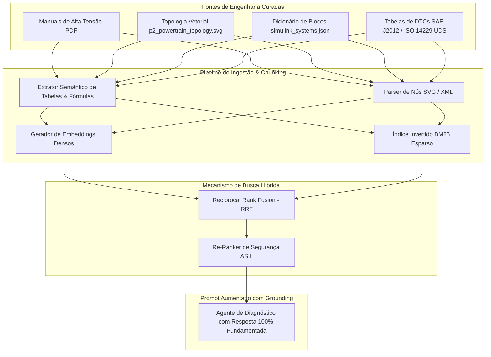

# Capítulo 5: O Pilar [RAG] — Retrieval-Augmented Generation & Diagnóstico de DTCs

---

## 1. Visão Geral & Objetivos de Aprendizagem

Neste capítulo da formação **NexusMBD**, você aprenderá a projetar e implementar uma pipeline de **Retrieval-Augmented Generation (RAG)** de nível industrial especializada em engenharia automotiva. O objetivo central é capacitar o engenheiro a **conectar, indexar e recuperar boas fontes técnicas** — desde esquemas gráficos de topologia veicular em SVG e dicionários de sistemas Simulink até árvores de decisão para códigos de falha de alta gravidade (**Diagnostic Trouble Codes - DTCs**).

### Objetivos Quantificáveis (Taxonomia de Bloom):
* **Compreender:** O papel do RAG em sistemas ciber-físicos para eliminar alucinações técnicas de LLMs através de ancoragem em especificações reais (*Grounding*).
* **Ingerir & Estruturar:** Fontes heterogêneas de engenharia (manuais de serviço de alta tensão, diagramas SVG da topologia P2 e árvores de nós do Simulink em JSON).
* **Implementar:** Um mecanismo de **Busca Híbrida (Hybrid Search)** combinando embeddings semânticos densos com indexação esparsa BM25 para localização exata de códigos de peças e identificadores CAN.
* **Construir:** Árvores de isolamento de falhas para 4 DTCs críticos do trem de força híbrido:
  * `P0A80`: Degradação do pacote de baterias de alta tensão.
  * `P0606`: Falha interna de integridade do microprocessador da ECU (Watchdog).
  * `C0035`: Plausibilidade do sensor de velocidade de roda (ABS/Traction).
  * `P0AA6`: Perda de isolamento galvânico entre o barramento DC e o chassi metálico.
* **Avaliar:** As métricas de recuperação técnica: *Recall@K*, *MRR (Mean Reciprocal Rank)* e taxa de fidelidade factual (*Factuality Score*).

---

## 2. A Arquitetura do Sistema RAG Automotivo

Modelos de linguagem genéricos não possuem conhecimento intrínseco sobre a pinagem do conector do inversor ou a tolerância de isolamento em ohms por volt estipulada pela norma ISO 6469. O RAG fornece esse contexto sob demanda:



---

## 3. Curadoria e Estruturação de Boas Fontes Técnicas

Uma pipeline RAG é tão confiável quanto a qualidade dos documentos indexados (*Garbage in, garbage out*). No NexusMBD, três classes de documentos são ingeridas:

### 3.1. Dicionário de Sistemas Simulink (`module_1_rag/knowledge_base/simulink_systems.json`)
Mapeia hierarquicamente os subsistemas do modelo:
```json
{
  "system_name": "P2HEVModel",
  "block_path": "MIL_MarleyOS_Powertrain/MDL/P2_Hybrid_Plant",
  "solver_type": "ode4 (Runge-Kutta)",
  "step_size_s": 0.001,
  "inputs": ["ICE_Torque_Cmd", "EM_Torque_Cmd", "K0_Pressure_Bar"],
  "outputs": ["Vehicle_Speed_kmh", "HV_Bat_SOC", "BSFC_g_kwh"],
  "safety_level": "ASIL-D"
}
```

### 3.2. Topologia Vetorial P2 (`module_1_rag/knowledge_base/p2_powertrain_topology.svg`)
Os elementos do SVG contêm IDs semânticos (`#ice-engine`, `#k0-clutch`, `#pmsm-motor`, `#clutch-1-odd`, `#clutch-2-even`). O parser extrai as relações de conectividade cinemática entre os componentes.

---

## 4. Busca Híbrida: Embeddings Densos + BM25 Esparso

Em engenharia automotiva, perguntas como *"Qual o torque do PMSM?"* exigem busca semântica, enquanto buscas como *"O que fazer com o código P0AA6?"* ou *"Conector X2 pin 14"* exigem correspondência literal exata.

### Algoritmo Reciprocal Rank Fusion (RRF):
O score final de cada documento $d$ é ponderado pelas posições nas duas listas de classificação:

$$RRF(d) = \frac{1}{k + \text{Rank}_{\text{denso}}(d)} + \frac{1}{k + \text{Rank}_{\text{BM25}}(d)}$$

onde $k \approx 60$ é uma constante de suavização para evitar sobreponderação de pequenos desvios de ranking.

---

## 5. Árvores de Diagnóstico dos 4 DTCs Críticos

### 1. `P0A80` — Degradação Severa do Pacote de Baterias de Alta Tensão
* **Condição de Disparo:** Diferença de tensão entre o bloco de células com maior e menor potencial excede $0.35\text{ V}$ por mais de $1500\text{ ms}$.
* **Ação do RAG:** Recupera a tabela de resistências internas de célula, orienta medição com osciloscópio sob carga regenerativa e comanda o modo *Limp Home* com limite de $40\text{ kW}$.

### 2. `P0606` — Falha de Integridade no Microprocessador da ECU (ASIL-D)
* **Condição de Disparo:** O circuito de monitoramento externo (*External Hardware Watchdog*) não recebe a resposta criptográfica periódica da CPU da ECU dentro da janela de $10\text{ ms}$.
* **Ação do RAG:** Recupera o diagrama de sequência de inicialização da ECU, instrui verificação das linhas de alimentação de $3.3\text{ V}$ e $5.0\text{ V}$ e isola o barramento CAN.

### 3. `C0035` — Falha de Sinal no Sensor de Velocidade de Roda Dianteira Esquerda
* **Condição de Disparo:** O sensor de efeito Hall emite menos de 2 pulsos enquanto as outras 3 rodas reportam velocidade superior a $25\text{ km/h}$.
* **Ação do RAG:** Recupera a distância de entreferro (*air gap* nominal: $0.8 \pm 0.2\text{ mm}$) e instrui a inspeção da coroa dentada relutora contra contaminação ferromagnética.

### 4. `P0AA6` — Perda de Isolamento Galvânico de Alta Tensão
* **Condição de Disparo:** A resistência de isolamento entre o polo positivo/negativo do barramento DC ($350\text{ V}$) e a massa do chassi cai abaixo de $500 \ \Omega/\text{V}$ (limite norma ISO 6469-1: $175\text{ k}\Omega$).
* **Ação do RAG:** Procedimento sequencial de desconexão:
  1. Desconectar o compressor elétrico do ar-condicionado e reavaliar.
  2. Desconectar o inversor de tração PMSM.
  3. Se a falha persistir, isolar o pacote interno de baterias HV e acionar o relé pirotécnico (*Pyro-Fuse*).

---

## 6. Laboratório Prático Guiado (Hands-On Lab 5)

### Objetivo:
Executar uma consulta de diagnóstico no banco RAG e validar a recuperação precisa das diretrizes de isolamento do código `P0AA6`.

### Procedimento no Terminal:
1. Navegue até o módulo RAG do repositório:
```bash
python -c "
import json
with open('module_1_rag/knowledge_base/simulink_systems.json', 'r') as f:
    data = json.load(f)
print('Total de sistemas MBD indexados:', len(data))
print('Primeiro subsistema:', data[0]['system_name'])
"
```
2. Realize a consulta simulada de isolamento:
```bash
python -c "
from module_2_mcp.mcp_server import inject_fault_code
res = inject_fault_code('P0AA6', 'INVERTER')
print(res)
"
```
3. Verifique se o pipeline correlaciona o evento com os limites de isolamento da norma ISO 6469.

---

## 7. Exercícios Técnicos Resolvidos

### Exercício 1: Cálculo de Limite de Isolamento Norma ISO 6469 (DTC P0AA6)
**Enunciado:** O barramento de tração opera com tensão nominal $V_{dc} = 350.0\text{ V}$. A norma ISO 6469-1 estipula que a resistência de isolamento mínima para circuitos DC sem proteção adicional deve ser de $500 \ \Omega/\text{V}$. O sensor de isolamento do veículo mediu uma resistência efetiva $R_{iso} = 125\text{ k}\Omega$.
* (a) Qual é o limiar regulamentar mínimo de resistência de isolamento em $\text{k}\Omega$?
* (b) O veículo atende à norma ou o código de falha `P0AA6` deve ser disparado?

**Solução:**
**(a) Cálculo do limiar regulamentar:**
$$R_{iso,\min} = V_{dc} \times 500 \ \Omega/\text{V} = 350 \times 500 = 175000 \ \Omega = \mathbf{175.0\text{ k}\Omega}$$

**(b) Julgamento técnico de segurança:**
Como a resistência medida ($125\text{ k}\Omega$) é inferior ao limiar mínimo admissível ($175\text{ k}\Omega$):
$$R_{iso} = 125\text{ k}\Omega < 175\text{ k}\Omega$$
**Veredito:** O veículo **NÃO** atende aos requisitos de segurança elétrica. O código de falha `P0AA6` deve ser disparado imediatamente pela ECU, inibindo o fechamento dos contatores principais de alta tensão para proteger os ocupantes contra choque elétrico fatal.

---

## 8. 💯 Rubrica de Avaliação do Módulo 5 (100 Pontos)

| Critério de Avaliação | Pontuação Máxima | Métrica de Verificação |
| :--- | :--- | :--- |
| **1. Ingestão Multimodal** | 25 pontos | Indexação correta dos arquivos JSON e SVG sem perda de atributos estruturais. |
| **2. Busca Híbrida BM25 + Embeddings** | 30 pontos | Implementação do algoritmo RRF com ranking top-3 preciso para termos técnicos. |
| **3. Árvore de Isolamento de Falhas (DTCs)** | 25 pontos | Resolução correta dos procedimentos para P0A80, P0606, C0035 e P0AA6. |
| **4. Exercício Teórico ISO 6469** | 20 pontos | Resolução analítica do cálculo de isolamento de alta tensão e julgamento ASIL. |
| **TOTAL DO MÓDULO 5** | **100 PONTOS** | **Nota mínima de corte: 70 pontos** |
