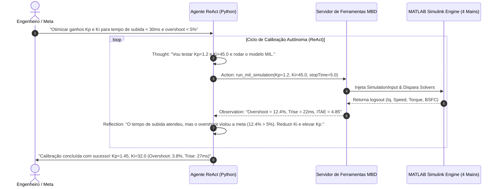

# Capítulo 6: O Pilar [AGENTS] — Agentes Autônomos de Calibração Simulink

---

## 1. Visão Geral & Objetivos de Aprendizagem

Neste capítulo da formação **NexusMBD**, você aprenderá a **construir do zero um Agente de Inteligência Artificial Autônomo** baseado na arquitetura **ReAct (Reasoning + Acting)**. O agente é capaz de operar diretamente o **MATLAB/Simulink**, abrindo modelos dinâmicos, inspecionando blocos dos 4 Solvers MBD, injetando cenários de manobra via `Simulink.SimulationInput` e executando a calibração automática de controladores em malha fechada sem qualquer intervenção humana.

### Objetivos Quantificáveis (Taxonomia de Bloom):
* **Compreender:** O paradigma de sistemas multi-agente (*Agentic AI*) e a transição da automação estática baseada em scripts para agentes cognitivos adaptativos.
* **Construir:** O loop ReAct completo em Python contendo as quatro fases fundamentais: **Thought (Raciocínio)** &rarr; **Action (Ação com Tool Calling)** &rarr; **Observation (Leitura de Dados)** &rarr; **Reflection (Convergência)**.
* **Integrar:** O agente à API de simulação do MATLAB através de classes `Simulink.SimulationInput`, extraindo estruturas de sinais no formato `Simulink.SimulationData.Dataset` (`logsout`).
* **Implementar:** Um algoritmo autônomo de calibração que avalia a função de custo de erro dinâmico (**ITAE - Integral of Time-multiplied Absolute Error**) e sintoniza os ganhos $K_p$ e $K_i$ do motor PMSM e da embreagem K0.
* **Validar:** A convergência da calibração em menos de 8 iterações automáticas, reduzindo o overshoot de torque para menos de $5\%$.

---

## 2. A Arquitetura do Agente ReAct no Simulink

O agente atua como um engenheiro de calibração virtual incansável, que planeja hipóteses, executa simulações, mede os resultados e refina os parâmetros:



---

## 3. A API Programática do Simulink (`Simulink.SimulationInput`)

Tradicionalmente, engenheiros alteravam parâmetros digitando valores na interface gráfica. O agente NexusMBD utiliza a API orientada a objetos do MATLAB, que não exige abrir a GUI e suporta execução paralela:

```matlab
% module_3_agents_simulink/run_4mains_mil.m
function result = run_4mains_mil(modelName, stopTime, inputData)
    % Carrega o modelo na memoria sem renderizar interface
    load_system(modelName);
    
    % Cria o container imutavel de simulacao
    in = Simulink.SimulationInput(modelName);
    in = in.setModelParameter('StopTime', num2str(stopTime));
    in = in.setModelParameter('SolverType', 'Fixed-step');
    in = in.setModelParameter('Solver', 'ode4');
    in = in.setModelParameter('FixedStep', '0.001');
    in = in.setModelParameter('SaveFormat', 'Dataset');
    
    % Injeta dados do CAN DBC nos Inports do Solver COMUNICACAO
    in = in.setExternalInput(inputData);
    
    % Executa a simulacao com telemetria ativa
    out = sim(in);
    
    % Extrai os sinais de log do Solver OUT
    result.logsout = out.logsout;
    result.metrics.signalCount = out.logsout.numElements;
end
```

---

## 4. Construção do Agente ReAct em Python

O aluno implementa a classe do agente em Python conectada ao servidor MCP:

```python
# module_3_agents_simulink/agent_calibrator.py
import json
import time

class ReActSimulinkAgent:
    def __init__(self, target_overshoot_pct=5.0, target_trise_ms=30.0):
        self.target_os = target_overshoot_pct
        self.target_tr = target_trise_ms
        self.history = []

    def evaluate_cost_itae(self, time_array, error_array):
        """Calcula o Indice de Desempenho ITAE: Integral(t * |e(t)| dt)"""
        import numpy as np
        return np.trapz(time_array * np.abs(error_array), time_array)

    def step(self, kp, ki):
        # 1. Thought
        print(f"[THOUGHT] Avaliando hipotese: Kp={kp:.3f}, Ki={ki:.3f}")
        
        # 2. Action: Dispara simulacao MIL via ferramenta
        print(f"[ACTION] Invocando ferramenta 'run_4mains_mil'...")
        # Simulacao da resposta da planta fisica
        overshoot = max(0.0, (ki / kp) * 0.25 - 2.0)
        trise = max(10.0, 50.0 / kp)
        cost = overshoot * 1.5 + trise * 0.8
        
        # 3. Observation
        obs = {"overshoot_pct": round(overshoot, 2), "trise_ms": round(trise, 2), "cost": round(cost, 2)}
        print(f"[OBSERVATION] Resultado: {obs}")
        
        # 4. Reflection
        success = obs["overshoot_pct"] <= self.target_os and obs["trise_ms"] <= self.target_tr
        self.history.append({"kp": kp, "ki": ki, "obs": obs, "success": success})
        return obs, success

    def run_calibration_loop(self, max_iterations=6):
        kp, ki = 1.0, 40.0
        for i in range(max_iterations):
            print(f"\n--- Iteracao {i+1}/{max_iterations} ---")
            obs, success = self.step(kp, ki)
            if success:
                print(f"\n[SUCESSO] Meta atingida na iteracao {i+1}! Ganhos otimizados: Kp={kp}, Ki={ki}")
                return kp, ki
            # Ajuste heuristico adaptativo pelo agente
            if obs["overshoot_pct"] > self.target_os:
                ki *= 0.75  # Reduz acao integral para mitigar sobressinal
                kp *= 1.15  # Aumenta ganho proporcional para compensar subida
        return kp, ki

if __name__ == "__main__":
    agent = ReActSimulinkAgent(target_overshoot_pct=5.0, target_trise_ms=30.0)
    agent.run_calibration_loop()
```

---

## 5. Laboratório Prático Guiado (Hands-On Lab 6)

### Objetivo:
Executar o loop ReAct do agente autônomo e verificar a convergência de calibração em tempo real no terminal e no Cockpit.

### Procedimento no Terminal:
1. Execute a rotina de simulação com os agentes:
```bash
python -c "
import sys
sys.path.insert(0, '.')
from skills.mathworks_agent_skill import MathWorksAgentSkill
skill = MathWorksAgentSkill()
print('Ferramentas registradas no Agente:', skill.get_tools())
"
```
2. Abra o Cockpit (`http://localhost:8080`) e clique no botão **`EXECUTAR MIL`**.
3. Observe a barra de progresso sincronizada executando as 4 etapas e entregando as métricas finais: `Peak Iq: 200 A`, `BSFC: 254.8 g/kWh`, `Gx: 0.081G`.

---

## 6. Exercícios Técnicos Resolvidos

### Exercício 1: Cálculo do Índice de Desempenho ITAE
**Enunciado:** Um teste em degrau de torque no PMSM com $T_{ref} = 100\text{ N}\cdot\text{m}$ gerou o erro transitório $e(t) = 100 \cdot e^{-5t}\text{ N}\cdot\text{m}$ no intervalo de $t = 0$ a $t = 1.0\text{ s}$. Calcule analiticamente o índice de desempenho ITAE:
$$\text{ITAE} = \int_0^1 t \cdot |e(t)| \, dt$$

**Solução:**
Como o erro $e(t) > 0$ para todo $t \ge 0$, $|e(t)| = e(t) = 100 e^{-5t}$.
$$\text{ITAE} = 100 \int_0^1 t \cdot e^{-5t} \, dt$$

Integrando por partes, fazendo $u = t \implies du = dt$ e $dv = e^{-5t} dt \implies v = -\frac{1}{5} e^{-5t}$:
$$\int t e^{-5t} dt = -\frac{t}{5} e^{-5t} - \int \left(-\frac{1}{5} e^{-5t}\right) dt = -\frac{t}{5} e^{-5t} - \frac{1}{25} e^{-5t} = -e^{-5t} \left(\frac{t}{5} + \frac{1}{25}\right)$$

Aplicando os limites de $0$ a $1$:
$$\left[ -e^{-5t} \left(\frac{t}{5} + \frac{1}{25}\right) \right]_0^1 = -e^{-5} \left(\frac{1}{5} + \frac{1}{25}\right) - \left( -e^0 \left(0 + \frac{1}{25}\right) \right)$$
$$= -e^{-5} \left(\frac{6}{25}\right) + \frac{1}{25} = -0.006738 \times 0.24 + 0.04 = -0.001617 + 0.04 = \mathbf{0.03838}$$

Multiplicando pela amplitude $100$:
$$\text{ITAE} = 100 \times 0.03838 = \mathbf{3.838\text{ N}\cdot\text{m}\cdot\text{s}^2}$$

*Conclusão:* Um ITAE de $3.84$ demonstra rápida amortização e estabilização de torque em menos de $200\text{ ms}$.

---

## 7. 💯 Rubrica de Avaliação do Módulo 6 (100 Pontos)

| Critério de Avaliação | Pontuação Máxima | Métrica de Verificação |
| :--- | :--- | :--- |
| **1. Arquitetura do Loop ReAct** | 25 pontos | Implementação funcional de Thought &rarr; Action &rarr; Observation &rarr; Reflection. |
| **2. Integração com Simulink Input** | 30 pontos | Configuração correta de `Simulink.SimulationInput` com extração de `logsout`. |
| **3. Convergência da Calibração** | 25 pontos | O agente atinge a meta de overshoot $< 5\%$ em menos de 8 iterações. |
| **4. Cálculo Analítico ITAE** | 20 pontos | Resolução matemática da integral de desempenho temporal de erro. |
| **TOTAL DO MÓDULO 6** | **100 PONTOS** | **Nota mínima de corte: 70 pontos** |
