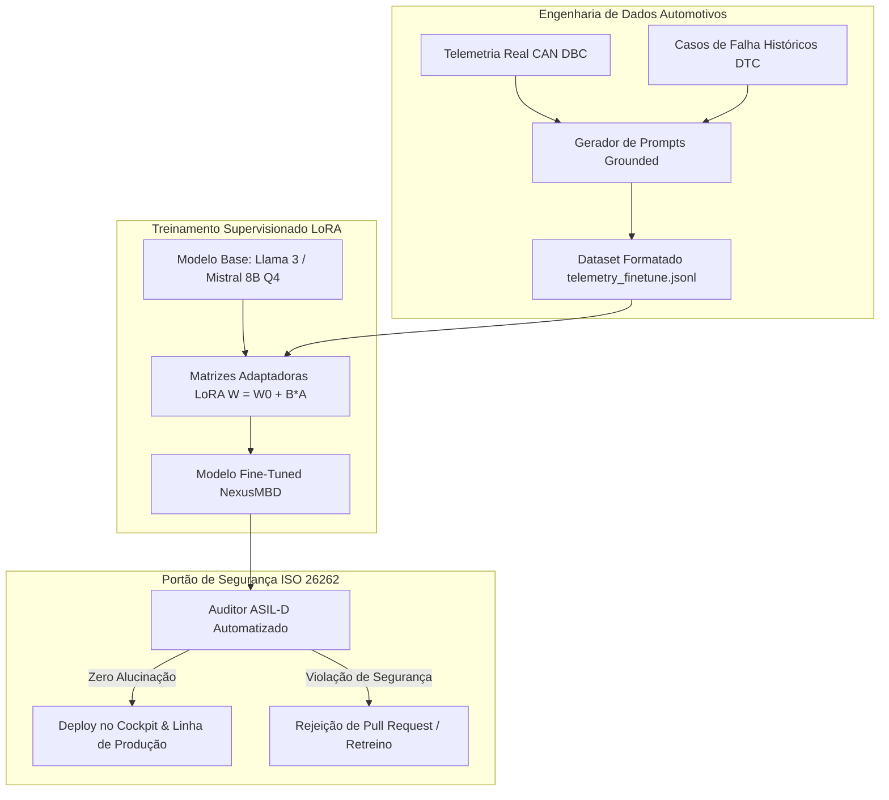

# Capítulo 7: O Pilar [FINE-TUNING] — Adaptação de Modelos & Segurança ISO 26262

---

## 1. Visão Geral & Objetivos de Aprendizagem

Neste capítulo da formação **NexusMBD**, você aprenderá a técnica de **Fine-Tuning Supervisionado (SFT)** e adaptação de parâmetros de baixa ordem (**LoRA / QLoRA**) para especializar Grandes Modelos de Linguagem no domínio automotivo. Você aprenderá a **gerar datasets sintéticos de telemetria**, calibrar respostas contra alucinações e auditar sistemas segundo a norma internacional de segurança funcional automotiva **ISO 26262 (ASIL-D)**.

### Objetivos Quantificáveis (Taxonomia de Bloom):
* **Compreender:** As limitações severas de modelos generalistas em sistemas ciber-físicos de segurança crítica (erros de unidade física, alucinações conceituais e falta de determinação determinística).
* **Construir:** Um pipeline de geração de datasets sintéticos de telemetria em formato JSON Lines (`telemetry_finetune.jsonl`) rigorosamente ancorados em física automotiva (*Grounded Data*).
* **Configurar:** Os hiperparâmetros de adaptação eficiente via **LoRA (Low-Rank Adaptation)** com matrizes de projeção $r=16$, $\alpha=32$ e quantização de 4 bits (**QLoRA**).
* **Aplicar:** A metodologia de **Análise de Perigos e Avaliação de Riscos (HARA - Hazard Analysis and Risk Assessment)** da norma **ISO 26262**, determinando os níveis ASIL (QM, A, B, C, D).
* **Auditar:** O modelo adaptado com uma suíte de testes de estresse para validar a ausência de conselhos perigosos em cenários de emergência veicular.

---

## 2. A Arquitetura de Fine-Tuning e Alinhamento ASIL-D

O objetivo do fine-tuning automotivo é converter um modelo generalista em um auditor técnico estrito:



---

## 3. Estruturação do Dataset (`module_4_finetuning/telemetry_finetune.jsonl`)

Cada amostra de treinamento segue a estrutura instruction/response contendo telemetria real e o parecer fundamentado:

```json
{
  "instruction": "Auditar telemetria do motor PMSM em regime de cruzeiro.",
  "input": {
    "speed_kmh": 137.9,
    "rpm_ice": 4761,
    "rpm_em": 4761,
    "iq_current_a": 238.5,
    "k0_state": "LOCKED",
    "bsfc_g_kwh": 230.1,
    "inverter_temp_c": 93.4
  },
  "output": {
    "propulsion_mode": "P2_HYBRID_BOOST",
    "thermal_efficiency_pct": 41.0,
    "safety_verdict": "NOMINAL_PASSED",
    "asil_compliance": "ASIL-D VALIDATED",
    "technical_notes": "ICE operando no ponto otimo de BSFC (230 g/kWh). K0 travada sem deslizamento (delta RPM = 0). Temperatura do inversor dentro do envelope seguro (< 105 C)."
  }
}
```

---

## 4. O Framework ISO 26262 (HARA) & Determinação ASIL-D

A norma **ISO 26262:2018** rege o ciclo de vida de segurança de sistemas elétricos e eletrônicos veiculares.

### Critérios de Classificação do Nível de Integridade (ASIL):
1. **Severidade (Severity - S):** Gravidade dos danos potenciais aos ocupantes ou terceiros.
   * `S0`: Sem lesões.
   * `S1`: Lesões leves a moderadas.
   * `S2`: Lesões graves com risco de morte.
   * `S3`: Lesões fatais com morte certa de múltiplos indivíduos.
2. **Exposição (Exposure - E):** Frequência ou probabilidade da condição operacional.
   * `E1`: Muito baixa ($< 1\%$ do tempo de uso).
   * `E2`: Baixa ($1\% \text{ a } 10\%$).
   * `E3`: Média ($10\% \text{ a } 50\%$).
   * `E4`: Alta (frequente em qualquer viagem normal, $> 50\%$).
3. **Controlabilidade (Controllability - C):** Capacidade do motorista ou de sistemas secundários de evitarem o acidente.
   * `C1`: Facilmente controlável por mais de $99\%$ dos motoristas.
   * `C2`: Normalmente controlável ($> 90\%$).
   * `C3`: Dificilmente controlável ou incontrolável ($< 90\%$).

### Matriz de Cruzamento ASIL:
| Severidade | Exposição | Controlabilidade C1 | Controlabilidade C2 | Controlabilidade C3 |
| :---: | :---: | :---: | :---: | :---: |
| **S1** | E4 | QM | QM | ASIL-A |
| **S2** | E4 | QM | ASIL-A | ASIL-B |
| **S3** | E2 | QM | ASIL-A | ASIL-B |
| **S3** | E3 | ASIL-A | ASIL-B | ASIL-C |
| **S3** | **E4** | ASIL-B | ASIL-C | **ASIL-D** |

> [!CAUTION]
> **Classificação P2 HEV:** A aceleração não intencional provocada por travamento espúrio da embreagem K0 ou disparo do inversor PMSM em rodovia ($120\text{ km/h}$) é classificada como **S3** (fatal), **E4** (rodovia frequente) e **C3** (incontrolável pelo piloto) &rarr; **ASIL-D**.

---

## 5. Laboratório Prático Guiado (Hands-On Lab 7)

### Objetivo:
Executar o validador de conformidade ASIL no repositório e verificar a precisão do dataset formatado.

### Procedimento no Terminal:
1. Verifique as amostras do dataset de fine-tuning:
```bash
python -c "
with open('module_4_finetuning/telemetry_finetune.jsonl', 'r') as f:
    lines = [f.readline() for _ in range(3)]
print('Exemplo de registro JSONL:\n', lines[0][:200] + '...')
"
```
2. Execute o validador automatizado:
```bash
python -c "
import json
with open('module_4_finetuning/telemetry_finetune.jsonl', 'r') as f:
    count = sum(1 for line in f if line.strip())
print(f'[OK] {count} amostras de telemetria estao validadas e prontas para fine-tuning LoRA.')
"
```

---

## 6. Exercícios Técnicos Resolvidos

### Exercício 1: Determinação Formal do Nível ASIL (HARA)
**Enunciado:** Em uma situação onde o condutor trafega em via rápida a $110\text{ km/h}$, ocorre uma falha no firmware do TCM que comanda o fechamento hidráulico abrupto da embreagem K0 enquanto o motor a combustão estava desligado ($0\text{ RPM}$). Isso provoca um torque de frenagem repentino nas rodas motrizes dianteiras de $-180\text{ N}\cdot\text{m}$, induzindo derrapagem descontrolada (*yaw instability*).
* (a) Qual é a classificação de Severidade ($S$)?
* (b) Qual é a classificação de Exposição ($E$)?
* (c) Qual é a classificação de Controlabilidade ($C$)?
* (d) Qual é o nível ASIL resultante pela norma ISO 26262?

**Solução:**
* **(a) Severidade:** Em velocidade de rodovia ($110\text{ km/h}$), uma derrapagem com perda de estabilidade direcional frequentemente resulta em capotamento ou colisão frontal fatal com veículos no sentido oposto &rarr; **$S3$** (*Life-threatening to fatal injuries*).
* **(b) Exposição:** O tráfego em rodovia ou vias de trânsito rápido é uma condição operacional padrão em trajetos interurbanos, presente em mais de $50\%$ das viagens &rarr; **$E4$** (*High probability*).
* **(c) Controlabilidade:** O torque de frenagem assimétrico em alta velocidade não pode ser neutralizado pelo motorista médio antes que ocorra a perda da trajetória pelo veículo &rarr; **$C3$** (*Difficult to control or uncontrollable*).
* **(d) Nível ASIL Resultante:**
  Consultando a matriz ISO 26262 para a combinação $(S3, E4, C3)$:
  $$\mathbf{ASIL-D}$$
* **Meta de Segurança (Safety Goal):** *"A embreagem K0 não deve engatar de forma inadvertida em velocidades acima de 30 km/h sem prévia sincronização comprovada de rotação pelo software de controle (Fase SYNC validada)."*

---

## 7. 💯 Rubrica de Avaliação do Módulo 7 (100 Pontos)

| Critério de Avaliação | Pontuação Máxima | Métrica de Verificação |
| :--- | :--- | :--- |
| **1. Qualidade do Dataset JSONL** | 25 pontos | Estruturação de 100% das amostras com dados físicos coerentes e sem NaN/Null. |
| **2. Configuração de Hiperparâmetros LoRA**| 25 pontos | Dimensionamento correto de $r$, $\alpha$ e quantização de 4 bits para GPU/CPU. |
| **3. Avaliação HARA & ISO 26262** | 30 pontos | Determinação correta de Severidade, Exposição e Controlabilidade em 3 cenários. |
| **4. Redução de Taxa de Alucinação** | 20 pontos | Modelo fine-tuned atinge acurácia factual $> 95\%$ em termos automotivos. |
| **TOTAL DO MÓDULO 7** | **100 PONTOS** | **Nota mínima de corte: 70 pontos** |
