# Capítulo 8: Projeto Capstone Integrado & Certificação Oficial NexusMBD

---

## 1. Visão Geral do Capstone

O **Projeto Capstone** é a síntese máxima da formação **NexusMBD // AI-Native Powertrain Engineering Suite**. Neste módulo final, você integrará em um único fluxo ininterrupto os 3 domínios físicos de engenharia (**ICE, BEV e Híbrido P2**) com os **4 Pilares de Inteligência Artificial** (**MCP, RAG, AGENTS e FINE-TUNING**).

```mermaid
graph LR
    subgraph STAGE_1 [1. Barramento Físico]
        A[CAN DBC Streaming 100ms] -->|MCP JSON-RPC| B[Servidor MCP Ativo]
    end

    subgraph STAGE_2 [2. Diagnóstico & RAG]
        B -->|Deteção de Anomalia K0| C[Busca Vetorial RAG]
        C -->|Manual Alta Tensão & Pinouts| D[Plano de Mitigação Técnico]
    end

    subgraph STAGE_3 [3. Calibração por Agente]
        D -->|Geração de Hipótese| E[Agente ReAct Simulink]
        E -->|Simulink.SimulationInput| F[Execução 4 Mains MIL]
        F -->|Otimização ITAE| G[Parâmetros Kp/Ki Sintonizados]
    end

    subgraph STAGE_4 [4. Auditoria de Segurança]
        G -->|Avaliação de Risco| H[Modelo Fine-Tuned ISO 26262]
        H -->|Laudo ASIL-D Validado| I[Deploy no Cockpit Esportivo 60 FPS]
    end
```



---

## 2. A Arquitetura do Pipeline Integrado (Passo a Passo)

1. **Estágio 1 — [MCP] Ingestão Contínua:** O script `telemetry_feeder.py` gera o fluxo de 18 canais CAN. O servidor `mcp_server.py` expõe as ferramentas para que agentes externos inspecionem rotações, correntes e pressões hidráulicas.
2. **Estágio 2 — [RAG] Consulta Semântica:** Ao identificar uma elevação no tempo de sincronização da embreagem K0 ($\Delta t > 350\text{ ms}$), o sistema consulta a base vetorial (`simulink_systems.json` e manuais) para verificar as tolerâncias de viscosidade do fluido hidráulico ATF.
3. **Estágio 3 — [AGENTS] Calibração Autônoma:** O Agente ReAct abre em segundo plano o modelo `MIL_MarleyOS_Powertrain.slx`, ajusta o ganho da rampa de pré-enchimento (*pre-fill*) e re-simula até atingir o tempo ótimo de $250\text{ ms}$.
4. **Estágio 4 — [FINE-TUNING] Parecer de Segurança Funcional:** O modelo especializado emite o parecer formal comprovando que a pressão aplicada não causa risco de derrapagem assimétrica (ASIL-D).
5. **Estágio 5 — Visualização no Cockpit:** O dashboard web (`http://localhost:8080`) reflete a telemetria normalizada com o selo verde `NOMINAL` e velocidade estabilizada.

---

## 3. 🎓 Sistema de Avaliação & Pontuação Geral do Curso

Para conquistar a **Certificação Executiva NexusMBD**, o aluno é avaliado continuamente ao longo dos módulos teóricos e no exame prático integrado:

| Módulo / Desafio | Domínio Avaliado | Pontuação Máxima |
| :--- | :--- | :--- |
| **Módulo 1: ICE** | Ciclo Miller, MAP Speed-Density, BSFC Sweet Spot ($230\text{ g/kWh}$) | **100 Pontos** |
| **Módulo 2: BEV** | Máquinas PMSM, Clarke/Park, FOC ($I_d/I_q$), Calibração MTPA | **100 Pontos** |
| **Módulo 3: HEV** | Híbrido P2, Estados K0, e-DCT, Divisão de Torque EMS | **100 Pontos** |
| **Módulo 4: [MCP]** | Servidor JSON-RPC do zero, Decodificação CAN DBC, Tool Calls | **100 Pontos** |
| **Módulo 5: [RAG]** | Ingestão de Manuais, Busca Híbrida BM25+Vetores, Árvores DTC | **100 Pontos** |
| **Módulo 6: [AGENTS]**| Agente ReAct, Simulação Simulink MIL, Otimização ITAE | **100 Pontos** |
| **Módulo 7: [FINE-TUNING]**| Datasets JSONL, Adaptação LoRA, Auditoria HARA / ISO 26262 | **100 Pontos** |
| **Módulo 8: Capstone** | **Exame Final Abrangente & Pipeline Integrado de Ponta a Ponta** | **300 Pontos** |
| **PONTUAÇÃO TOTAL MÁXIMA** | **FORMAÇÃO COMPLETA NEXUSMBD** | **1.000 PONTOS** |

### Critérios de Aprovação e Níveis de Distinção:
* **$\ge 900\text{ Pontos}$ ($90\% - 100\%$):** **Aprovado com Distinção de Excelência (*Summa Cum Laude / AI Powertrain Master*)** &rarr; Habilitado para liderança de arquitetura de software automotivo e calibração de IA.
* **$800 - 899\text{ Pontos}$ ($80\% - 89\%$):** **Aprovado com Honra (*Honors*)** &rarr; Proficiência sólida em modelagem MBD e agentes de simulação.
* **$700 - 799\text{ Pontos}$ ($70\% - 79\%$):** **Aprovado (*Certified Powertrain Engineer*)** &rarr; Cumpre todos os requisitos de modelagem e integração.
* **$< 700\text{ Pontos}$ ($< 70\%$):** Reprovado / Necessita refazer os laboratórios práticos.

---

## 4. 📝 O Exame Final Abrangente (300 Pontos)

O exame final é composto por 5 desafios práticos e conceituais de engenharia avançada executados pelo avaliador automatizado:

### Desafio 1: Calibração Dinâmica da Pressão MAP (60 Pontos)
Dada uma aceleração de 0 a 100 km/h, o aluno deve garantir que o erro médio de predição do coletor de admissão seja inferior a $2.5\text{ kPa}$ frente ao transdutor real.

### Desafio 2: Sintonia de Banda Larga do Inversor PMSM (60 Pontos)
Projetar os ganhos de corrente $K_p, K_i$ para que o tempo de resposta a degrau de $150\text{ A}$ no eixo $q$ ocorra em menos de $15\text{ ms}$ com sobre-sinal menor que $4\%$.

### Desafio 3: Isolamento Autônomo de DTC com RAG (60 Pontos)
Injetar o código `P0AA6` no barramento CAN virtual e comprovar que o sistema RAG recupera as 3 etapas de isolamento com assertividade factual de $100\%$.

### Desafio 4: Otimização Autônoma via Agente ReAct (60 Pontos)
Disparar o agente autônomo e verificar se ele converge para a função de custo mínima (ITAE $< 4.5$) em menos de 8 rodadas de simulação no Simulink.

### Desafio 5: Laudo de Segurança Funcional ISO 26262 ASIL-D (60 Pontos)
Validar a resposta do modelo adaptado para a manobra de frenagem de emergência com falha de embreagem, atestando a integridade do código gerado.

---

## 5. Como Executar a Avaliação & Emitir seu Certificado Oficial

Para submeter seu projeto, rodar a suíte de testes de todos os módulos e gerar seu certificado digital autenticado:

```bash
python course/certification/evaluate_course.py --student "Nome do Engenheiro"
```

O script executará a validação dos 8 módulos, computará a pontuação de 0 a 1.000 pontos e, obtendo pontuação $\ge 700$, gerará:
1. **Certificado em Alta Resolução:** `course/certification/certificado_conclusao.html`
2. **Hash Criptográfico de Autenticidade (SHA-256):** Gravado no corpo do certificado para validação em processos de auditoria industrial e vagas automotivas.
3. **Selo de Conformidade:** *ISO 26262 Certified Powertrain AI Architect*.
