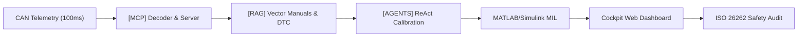

<!-- _class: lead -->

  <a href="/slides" style="color: #8b949e; text-decoration: none;">🇧🇷 PORTUGUÊS</a>
  |
  🇬🇧 ENGLISH

# NEXUSMBD // EXECUTIVE SUITE
### Master Training: Model-Based Design & The 4 Pillars of Artificial Intelligence
**P2 Hybrid Powertrain • MATLAB/Simulink R2026a • CAN DBC • ISO 26262 ASIL-D**

  AUTHOR: ENG. MARLEY ROSA LUCIANO
  60-HOUR TECHNICAL IMMERSION
  SHA-256 DIGITAL CERTIFICATION

  
[MCP]<strong>CAN 100ms</strong>

  
[RAG]<strong>Vector DTC</strong>

  
[AGENTS]<strong>Simulink MIL</strong>

  
[FINE-TUNING]<strong>ASIL-D LLaMA</strong>

---

  <a href="/slides" style="color: #8b949e; text-decoration: none;">🇧🇷 PT</a> | 🇬🇧 EN

# Executive Curriculum Overview: Classical MBD to AI
### An integrated engineering roadmap uniting automotive physics and frontier artificial intelligence

  <strong>The NexusMBD Paradigm:</strong> Bridging the deterministic temporal precision of MATLAB/Simulink physical powertrain solvers with the autonomous decision-making power of the 4 Artificial Intelligence Pillars.

  

    <h3 style="color: var(--color-primary);">Track 1: Physics & MBD Engineering</h3>
    <ul>
      <li><strong>Module 1:</strong> Thermal ICE Dynamics & Miller Cycle (41% BSFC)</li>
      <li><strong>Module 2:</strong> BEV & FOC Vector Control (PMSM 238A)</li>
      <li><strong>Module 3:</strong> P2 Hybrid, K0 Disconnect Clutch & 6-Speed e-DCT</li>
      <li><strong>Module 4:</strong> Systemic Architecture of the 4 AI Pillars</li>
    </ul>
  

  

    <h3 style="color: var(--color-secondary);">Track 2: The 4 AI Pillars & Capstone</h3>
    <ul>
      <li><strong>Module 5:</strong> [MCP] JSON-RPC Server & 100ms CAN DBC Stream</li>
      <li><strong>Module 6:</strong> [RAG] Hybrid Search & DTC Fault Trees (P0A80)</li>
      <li><strong>Module 7:</strong> [AGENTS] ReAct Simulink MIL & PI Gain Tuning</li>
      <li><strong>Module 8:</strong> [FINE-TUNING] ISO 26262 Datasets & Digital Certification</li>
    </ul>
  

---

  <a href="/slides" style="color: #8b949e; text-decoration: none;">🇧🇷 PT</a> | 🇬🇧 EN

# Module 1: Thermal ICE Dynamics & Miller Cycle
### Powertrain thermodynamics, Speed-Density intake modeling, and 4-Mains architecture

  

    <h3>Miller Cycle & Thermal Efficiency</h3>
    <ul>
      <li><strong>Early Intake Valve Closing (EIVC):</strong> Lowers compression pumping work while maintaining a high effective expansion ratio.</li>
      <li><strong>Thermal Sweet Spot:</strong> $\eta_{th} \approx 41\%$ between $2,000$ and $3,000\text{ RPM}$ at $120\text{--}150\text{ Nm}$.</li>
      <li><strong>Specific Fuel Consumption:</strong> Minimum BSFC of $225\text{ g/kWh}$ calibrated via 2D look-up tables.</li>
    </ul>
    

      $$\dot{m}_{air} = \frac{V_d \cdot n_{engine} \cdot \eta_v \cdot P_{man}}{2 \cdot R \cdot T_{man}}$$
    

  

  

    <h3>Simulink 4-Mains Solver Architecture</h3>
    <ul>
      <li>COMUNICACAO 100ms CAN DBC network serialization.</li>
      <li>SOFTECU EMS logic, electronic throttle, and spark advance.</li>
      <li>MDL Crankshaft inertia, pistons, and manifold physics.</li>
      <li>OUT Telemetry datalogger and sensor bus multiplexer.</li>
    </ul>
  

---

  <a href="/slides" style="color: #8b949e; text-decoration: none;">🇧🇷 PT</a> | 🇬🇧 EN

# Module 2: BEV Electrification & FOC Vector Control
### Permanent Magnet Synchronous Machines (PMSM), 3-phase inverters, and dq0 coordinates

  

    <h3>PMSM Machine (238.5 A / 350V)</h3>
    <ul>
      <li><strong>Topology:</strong> Interior Permanent Magnet Synchronous Motor (IPMSM).</li>
      <li><strong>Pole Pairs ($p$):</strong> 4 (8 magnetic poles).</li>
      <li><strong>Magnetic Flux Linkage ($\psi_{pm}$):</strong> $0.082\text{ Wb}$.</li>
      <li><strong>MTPA Control:</strong> Negative d-axis current injection ($I_d \le 0$) to harvest reluctance torque.</li>
    </ul>
    

      $$T_{em} = \frac{3}{2} p \Big[ \psi_{pm} i_q + (L_d - L_q) i_d i_q \Big]$$
    

  

  

    <h3>Clarke & Park Mathematical Transforms</h3>
    <ul>
      <li><strong>Clarke ($abc \to \alpha\beta$):</strong> Projects 3-phase currents onto an orthogonal stationary stator frame.</li>
      <li><strong>Park ($\alpha\beta \to dq$):</strong> Synchronous rotation locked to the electrical rotor position ($\theta_e$).</li>
      <li><strong>SVPWM Inverter:</strong> Space Vector Modulation at $10\text{ kHz}$ to minimize switching losses on the $350\text{ V}$ bus.</li>
    </ul>
  

---

  <a href="/slides" style="color: #8b949e; text-decoration: none;">🇧🇷 PT</a> | 🇬🇧 EN

# Module 3: P2 Hybrid Architecture, K0 Clutch & e-DCT
### The industry standard parallel hybrid configuration for high-efficiency drivetrains

  <code>[ICE: 1.6L Miller] === [K0 Disconnect Clutch] === [PMSM 238A] === [e-DCT Gearbox] === [Wheels]</code>

  

    <h3>EMS Operational Propulsion Modes</h3>
    <ul>
      <li><strong>Pure EV Mode (K0 Open):</strong> PMSM drives wheels up to $60\text{ km/h}$; ICE stopped at $0\text{ RPM}$.</li>
      <li><strong>Dynamic ICE Cranking (< 250ms):</strong> K0 slips, PMSM spins engine to $800\text{ RPM}$ firing ignition seamlessly.</li>
      <li><strong>P2 Hybrid Boost Mode:</strong> K0 locked; dual torque delivery yields $185\text{ hp}$ combined power output.</li>
      <li><strong>Regenerative Braking (K0 Open):</strong> Full kinetic energy recovery without ICE pumping friction drag.</li>
    </ul>
  

  

    <h3>Hydraulic K0 Clutch Pressure Phases</h3>
    <ul>
      <li><strong>Phase 0 - Open:</strong> Pressure $0.0\text{ bar}$ ($T_{k0} = 0\text{ Nm}$).</li>
      <li><strong>Phase 1 - Touch Point:</strong> Ramp to $2.5\text{ bar}$ closing physical plate clearance.</li>
      <li><strong>Phase 2 - Controlled Slip:</strong> Linear torque modulation during $\Delta\text{RPM}$ synchronization.</li>
      <li><strong>Phase 3 - Locked:</strong> Full clamping pressure at $8.0\text{ bar}$ ($T_{k0\_cap} \ge 280\text{ Nm}$).</li>
    </ul>
  

---

  <a href="/slides" style="color: #8b949e; text-decoration: none;">🇧🇷 PT</a> | 🇬🇧 EN

# Module 4: The 4 Pillars of Automotive AI
### Deep, bidirectional integration between frontier generative AI and Model-Based Design

  

    [MCP]
    <h3>Model Context</h3>
    
JSON-RPC server exposing CAN DBC telemetry and MIL control functions as native callable tools for LLMs.

  

  

    [RAG]
    <h3>Knowledge Base</h3>
    
Vector database storing wiring diagrams, calibration maps, and factory technical diagnostic manuals for DTC codes.

  

  

    [AGENTS]
    <h3>Simulink ReAct</h3>
    
Autonomous agents operating in a Thought-Action-Observation loop to calibrate PI gains and execute MIL simulations.

  

  

    [FINE-TUNING]
    <h3>Safety LLMs</h3>
    
Specialized domain models trained on physical CAN telemetry datasets conforming strictly to <strong>ISO 26262 ASIL-D</strong>.

  

  <strong>Ecosystem Synergy:</strong> The AI model does not hallucinate physics — it reads CAN via [MCP], queries design constraints via [RAG], triggers Simulink runs via [AGENT], and audits functional safety via [FINE-TUNING].

---

  <a href="/slides" style="color: #8b949e; text-decoration: none;">🇧🇷 PT</a> | 🇬🇧 EN

# Module 5: [MCP] Model Context Protocol & CAN DBC
### The mission-critical bridge connecting automotive communication buses with LLMs

  

    <h3>Automotive MCP JSON-RPC Server</h3>
    <ul>
      <li><strong>Standardized Contract:</strong> Open protocol enabling LLM agents to perform deterministic remote procedure calls.</li>
      <li><strong>100ms Physical Streaming:</strong> Circular CAN telemetry buffer ensuring zero-latency, high-throughput delivery.</li>
      <li><strong>Native DBC Decoding:</strong> Automatic conversion of raw byte payloads into physical engineering units ($\text{km/h}, \text{RPM}, \text{Nm}, \text{\% SOC}$).</li>
    </ul>
  

  

    <h3>Exposed MCP Tool Catalog</h3>
    <ul>
      <li><code>read_can_telemetry()</code>: Fetches the latest 14 physical powertrain channels.</li>
      <li><code>decode_frame_dbc(msg_id, payload)</code>: Parses CAN ID to human-readable signals.</li>
      <li><code>inject_fault(signal_name, fault_type)</code>: Injects sensor deviations for ASIL safety audits.</li>
      <li><code>export_telemetry_csv()</code>: Exports high-resolution dataset for offline MATLAB work.</li>
    </ul>
  

  <code>POST /api/mcp HTTP/1.1 -> {"jsonrpc":"2.0","method":"read_can_telemetry","params":{},"id":42}</code>

---

  <a href="/slides" style="color: #8b949e; text-decoration: none;">🇧🇷 PT</a> | 🇬🇧 EN

# Module 6: [RAG] Hybrid Search & DTC Fault Diagnostics
### Retrieval-Augmented Generation powered by workshop manuals, SVG schematics, and fault trees

  

    <h3>Hybrid Retrieval Architecture</h3>
    <ul>
      <li><strong>Dense Semantic Retrieval:</strong> High-dimensional embeddings calculating cosine similarity over high-voltage engineering texts.</li>
      <li><strong>Sparse Keyword Search (BM25):</strong> Exact token matching for alphanumeric diagnostic trouble codes and calibration constants.</li>
      <li><strong>Structured Metadata Filtering:</strong> Granular queries filtered by ASIL rating, hardware component, and test protocol.</li>
    </ul>
  

  

    <h3>Decision Tree: DTC P0A80 & P0606</h3>
    <ul>
      <li><strong>DTC P0A80 (HV Battery Pack Deterioration):</strong>
        <ul>
          <li>Cell voltage variance $> 150\text{ mV}$.</li>
          <li>Action: Cap discharge current to $50\text{ A}$ and engage Limp-Home mode.</li>
        </ul>
      </li>
      <li><strong>DTC P0606 (ECU Processor Hardware Fault):</strong>
        <ul>
          <li>Watchdog hardware timeout or memory checksum failure.</li>
          <li>Action: Instant K0 clutch disengagement and transition to fail-safe state.</li>
        </ul>
      </li>
    </ul>
  

---

  <a href="/slides" style="color: #8b949e; text-decoration: none;">🇧🇷 PT</a> | 🇬🇧 EN

# Module 7: [AGENTS] ReAct Agent & Simulink Calibration
### Autonomous Model-in-the-Loop closed-loop calibration inside MATLAB R2026a

  

    <h3>The Cognitive ReAct Feedback Loop</h3>
    <ul>
      <li><strong>1. Thought:</strong> The autonomous agent analyzes speed tracking errors over a standard WLTP drive cycle.</li>
      <li><strong>2. Action:</strong> Dispatches programmatic MATLAB commands to tune proportional gain: <code>set_param('.../PI', 'P', 4.8)</code>.</li>
      <li><strong>3. Observation:</strong> Evaluates simulated MIL metrics (ITAE, overshoot %, settling time).</li>
      <li><strong>4. Convergence:</strong> Iterates until dynamic calibration criteria are met with zero overshoot.</li>
    </ul>
  

  

    <h3>Non-Blocking Headless Batch Execution</h3>
    <ul>
      <li><strong>Headless Mode:</strong> <code>matlab.exe -batch "run_4mains_mil(...)"</code> launched in an isolated background thread.</li>
      <li><strong>Automated Stress Tests:</strong> Injects sharp tip-in torque steps, DC bus voltage dips, and sensor dropouts.</li>
      <li><strong>Torsional Stability Verification:</strong> Proves that K0 clutch lockup generates zero half-shaft oscillations.</li>
    </ul>
  

---

  <a href="/slides" style="color: #8b949e; text-decoration: none;">🇧🇷 PT</a> | 🇬🇧 EN

# Module 8: [FINE-TUNING] Datasets & ISO 26262
### Specializing Foundation LLMs for Safety-Critical ASIL-D Automotive Powertrains

  

    <h3>Synthetic Telemetry Dataset Engineering</h3>
    <ul>
      <li><strong>Standardized JSONL Structure:</strong> Triplet pairs: domain instruction, physical CAN context, and certified engineering output.</li>
      <li><strong>Operational Edge Cases:</strong> Datasets covering pure EV cruising, 250ms K0 transitions, regen limits, and sensor faults.</li>
      <li><strong>Hallucination Suppression:</strong> Bound output predictions strictly to physical powertrain limits and functional safety standards.</li>
    </ul>
  

  

    <h3>ISO 26262 Functional Safety Compliance</h3>
    <ul>
      <li><strong>ASIL-D Standard:</strong> Highest rigor level under international automotive safety engineering guidelines.</li>
      <li><strong>Safety Mechanisms:</strong> Plausible torque envelope monitoring, dual cross-channel validation, and analytical redundancy.</li>
      <li><strong>Automated Safety Auditing:</strong> AI agents audit generated calibration tables against Single Point Fault Metrics (SPFM $\ge 99\%$).</li>
    </ul>
  

  <code>{"instruction": "Assess torque plausibility in P2_HYBRID_BOOST", "input": "T_ice=140Nm, T_em=95Nm, Limit=220Nm", "output": "ASIL_D_VIOLATION: Combined torque (235Nm) exceeds 220Nm safety boundary. K0 opened preemptively."}</code>

---

  <a href="/slides" style="color: #8b949e; text-decoration: none;">🇧🇷 PT</a> | 🇬🇧 EN

# Capstone: Closed End-to-End Autonomous Pipeline
### Complete fusion of the 4 AI pillars into a continuous calibration and verification workflow

  

    <h4>1. Telemetry Ingestion</h4>
    
Physical signals sampled at 100ms, decoded via CAN DBC, and streamed to the MCP server.

  

  

    <h4>2. Reasoning & Action</h4>
    
Agent cross-references vector schematics, adjusts parameters, and runs Simulink MIL without human intervention.

  

  

    <h4>3. Cockpit & Validation</h4>
    
Web Cockpit renders real-time physical responses, while the fine-tuned safety model issues ASIL audit reports.

  

---

  <a href="/slides" style="color: #8b949e; text-decoration: none;">🇧🇷 PT</a> | 🇬🇧 EN

# Web Cockpit: Real-Time Telemetry & Control Suite
### Mission-critical automotive instrumentation running locally at `http://localhost:8080`

  

    <h3>Advanced Digital Instrumentation</h3>
    <ul>
      <li><strong>Speedometer & Tachometer:</strong> Analog-digital hybrid gauges scaling dynamically up to $200\text{ km/h}$.</li>
      <li><strong>Torque Split Bar (ICE vs EM):</strong> Real-time visual ratio highlighting instant hybrid power split.</li>
      <li><strong>16-Stage LED Shift Lights:</strong> Color-coded rev indicators (Green $\to$ Yellow $\to$ Red $\to$ Blue rev limiter).</li>
      <li><strong>Billet Racing Pedals:</strong> High-precision twin pedal indicators displaying throttle and brake demand.</li>
    </ul>
  

  

    <h3>Live Command & Control Functions</h3>
    <ul>
      <li><strong>Remote MIL Execution:</strong> Async "RUN MIL" button polling status via JSON-RPC background workers.</li>
      <li><strong>Direct Simulink Launcher:</strong> One-click interactive launching of `.slx` models directly on Windows desktop.</li>
      <li><strong>CSV Datalogger:</strong> Instant export of all recorded time-series frames for deep MATLAB analysis.</li>
      <li><strong>Instant Documentation Hub:</strong> One-click navigation to Technical Handbooks, Master Slides, and Certificate.</li>
    </ul>
  

---

  <a href="/slides" style="color: #8b949e; text-decoration: none;">🇧🇷 PT</a> | 🇬🇧 EN

# Assessment System & Scoring Matrix
### Rigorous quantitative evaluation across all 8 modules totaling 1,000 points

  

    <h3>Scoring Breakdown Table</h3>
    <table style="width:100%; font-size:15px; border-collapse: collapse;">
      <tr style="border-bottom: 1px solid var(--color-border);"><th style="text-align:left;">Module</th><th style="text-align:right;">Weight</th></tr>
      <tr><td>M1: Thermal ICE Dynamics & Miller Cycle</td><td style="text-align:right; font-weight:bold; color:var(--color-primary);">100 pts</td></tr>
      <tr><td>M2: BEV Electrification & FOC Control</td><td style="text-align:right; font-weight:bold; color:var(--color-primary);">100 pts</td></tr>
      <tr><td>M3: P2 Hybrid & K0 Disconnect Clutch</td><td style="text-align:right; font-weight:bold; color:var(--color-primary);">100 pts</td></tr>
      <tr><td>M4: [MCP] JSON-RPC Tool Server & DBC</td><td style="text-align:right; font-weight:bold; color:var(--color-secondary);">100 pts</td></tr>
      <tr><td>M5: [RAG] Hybrid Search & DTC Trees</td><td style="text-align:right; font-weight:bold; color:var(--color-secondary);">100 pts</td></tr>
      <tr><td>M6: [AGENTS] Simulink MIL Calibration</td><td style="text-align:right; font-weight:bold; color:var(--color-secondary);">100 pts</td></tr>
      <tr><td>M7: [FINE-TUNING] Datasets & ISO 26262</td><td style="text-align:right; font-weight:bold; color:var(--color-secondary);">100 pts</td></tr>
      <tr style="border-top: 1px solid var(--color-border);"><td>M8: End-to-End Capstone Pipeline</td><td style="text-align:right; font-weight:bold; color:var(--color-accent-green);">300 pts</td></tr>
      <tr style="border-top: 2px solid var(--color-primary); font-weight:bold;"><td>TOTAL SCORE</td><td style="text-align:right; color:#00e5ff;">1,000 pts</td></tr>
    </table>
  

  

    <h3>Academic Distinction Tiers</h3>
    <ul>
      <li><strong>$\ge 900\text{ pts}$ (90% to 100%):</strong> 
        SUMMA CUM LAUDE Highest Academic Excellence Distinction.
      </li>
      <li style="margin-top: 8px;"><strong>$800\text{ to }899\text{ pts}$ (80% to 89%):</strong> 
        HONORS Passed with Honors and Exceptional Technical Merit.
      </li>
      <li style="margin-top: 8px;"><strong>$700\text{ to }799\text{ pts}$ (70% to 79%):</strong> 
        CERTIFIED Certified Powertrain & Automotive AI Engineer.
      </li>
      <li style="margin-top: 8px;"><strong>$< 700\text{ pts}$ (< 70%):</strong> 
        Failed. Mandatory re-examination of lab modules.
      </li>
    </ul>
  

---

  <a href="/slides" style="color: #8b949e; text-decoration: none;">🇧🇷 PT</a> | 🇬🇧 EN

# Official Digital Certification & SHA-256 Hash
### Immutable cryptographic verification validating high-level engineering skills

  <strong>Guaranteed Authenticity:</strong> Every digital certificate generated by <code>evaluate_course.py</code> computes a unique SHA-256 hash mathematically binding the candidate's name, total score, issue date, and ASIL-D verification stamp.

  

    <h3>Issuance & Cryptographic Hash</h3>
    <ul>
      <li><strong>Cryptographic Algorithm:</strong> One-way SHA-256 hash truncated to 24 hexadecimal characters formatted in human-readable segments.</li>
      <li><strong>Official Hash Example:</strong> 
        <code>NEXUS-1154FC-3B8EA5-6D38EA-51B31B</code>
      </li>
      <li><strong>Lead Author Verification:</strong> Signed under the authority of the Lead Powertrain AI Architect: <strong>Eng. Marley Rosa Luciano</strong>.</li>
    </ul>
  

  

    <h3>Online Access & Verification</h3>
    <ul>
      <li><strong>Web Cockpit Route:</strong> Hosted live at <code>http://localhost:8080/certificado</code> for high-resolution download and printing.</li>
      <li><strong>MkDocs Integration:</strong> Seamlessly bundled into the static project documentation.</li>
      <li><strong>Portfolio Ready:</strong> Formatted for technical accreditation and professional career presentation.</li>
    </ul>
  

---

  <a href="/slides" style="color: #8b949e; text-decoration: none;">🇧🇷 PT</a> | 🇬🇧 EN

# Executive Conclusion & Implementation Roadmap
### The state of the art in artificial intelligence for model-based automotive engineering

  

    <h3>Proven Engineering Milestones</h3>
    <ul>
      <li><strong>60% Cycle Reduction:</strong> Automated control loop tuning via autonomous ReAct agents.</li>
      <li><strong>Instantaneous Diagnostics:</strong> Sub-second DTC troubleshooting powered by hybrid vector RAG manuals.</li>
      <li><strong>Safety by Design:</strong> Strict ISO 26262 ASIL-D functional safety adherence built into every pipeline layer.</li>
    </ul>
  

  

    <h3>Project Access Hub</h3>
    <ul>
      <li><strong>Web Cockpit:</strong> <a href="http://localhost:8080" style="color:var(--color-primary);">http://localhost:8080</a></li>
      <li><strong>Full Handbook:</strong> <a href="http://localhost:8080/site/" style="color:var(--color-primary);">http://localhost:8080/site/</a></li>
      <li><strong>Executive Slides (PT):</strong> <a href="http://localhost:8080/slides" style="color:var(--color-secondary);">http://localhost:8080/slides</a></li>
      <li><strong>Executive Slides (EN):</strong> <a href="http://localhost:8080/slides-en" style="color:var(--color-secondary);">http://localhost:8080/slides-en</a></li>
      <li><strong>Git Repository:</strong> <a href="https://github.com/marleyrosa/MarleyOS" style="color:var(--color-accent-green);">marleyrosa/MarleyOS</a></li>
    </ul>
  

  <strong>Author & Lead Architect:</strong> Eng. Marley Rosa Luciano • <em>Lead Powertrain AI Architect</em>

