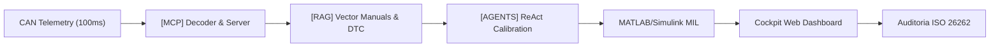

<!-- _class: lead -->

  🇧🇷 PORTUGUÊS
  |
  <a href="/slides-en" style="color: #8b949e; text-decoration: none;">🇬🇧 ENGLISH</a>

# NEXUSMBD // SUITE EXECUTIVA
### Formação Master: Model-Based Design & Os 4 Pilares de Inteligência Artificial
**Powertrain Híbrido P2 • MATLAB/Simulink R2026a • CAN DBC • ISO 26262 ASIL-D**

  AUTOR: ENG. MARLEY ROSA LUCIANO
  60 HORAS DE IMERSÃO TÉCNICA
  CERTIFICAÇÃO DIGITAL SHA-256

  
[MCP]<strong>CAN 100ms</strong>

  
[RAG]<strong>Vetorial DTC</strong>

  
[AGENTS]<strong>Simulink MIL</strong>

  
[FINE-TUNING]<strong>ASIL-D LLaMA</strong>

---

  🇧🇷 PT | <a href="/slides-en" style="color: #8b949e; text-decoration: none;">🇬🇧 EN</a>

# Visão Geral da Formação: Do MBD Clássico à IA
### Uma jornada integrada de engenharia automotiva e inteligência artificial

  <strong>O Paradigma NexusMBD:</strong> Unir a precisão temporal determinística dos modelos físicos no MATLAB/Simulink com a autonomia decisória dos 4 Pilares de Inteligência Artificial aplicada ao setor automotivo.

  

    <h3 style="color: var(--color-primary);">Trilha 1: Física & Engenharia MBD</h3>
    <ul>
      <li><strong>Módulo 1:</strong> Dinâmica ICE & Ciclo Miller (BSFC 41%)</li>
      <li><strong>Módulo 2:</strong> BEV & Controle Vetorial FOC (PMSM 238A)</li>
      <li><strong>Módulo 3:</strong> Híbrido P2, Embreagem K0 & e-DCT 6-Speed</li>
      <li><strong>Módulo 4:</strong> Visão Sistêmica dos 4 Pilares de IA</li>
    </ul>
  

  

    <h3 style="color: var(--color-secondary);">Trilha 2: Os 4 Pilares de IA & Capstone</h3>
    <ul>
      <li><strong>Módulo 5:</strong> [MCP] Servidor JSON-RPC & CAN DBC 100ms</li>
      <li><strong>Módulo 6:</strong> [RAG] Busca Híbrida & Árvores DTC (P0A80)</li>
      <li><strong>Módulo 7:</strong> [AGENTS] ReAct Simulink MIL & Calibração PI</li>
      <li><strong>Módulo 8:</strong> [FINE-TUNING] Datasets ISO 26262 & Certificação</li>
    </ul>
  

---

  🇧🇷 PT | <a href="/slides-en" style="color: #8b949e; text-decoration: none;">🇬🇧 EN</a>

# Módulo 1: Dinâmica Térmica ICE & Ciclo Miller
### Termodinâmica veicular, admissão Speed-Density e arquitetura 4 Mains

  

    <h3>Ciclo Miller & Eficiência Térmica</h3>
    <ul>
      <li><strong>Fechamento Antecipado (EIVC):</strong> Reduz trabalho de compressão e eleva taxa de expansão efetiva.</li>
      <li><strong>Sweet Spot Térmico:</strong> $\eta_{th} \approx 41\%$ na faixa de $2.000$ a $3.000\text{ RPM}$ com $120\text{--}150\text{ Nm}$.</li>
      <li><strong>Consumo Específico:</strong> Mínimo BSFC de $225\text{ g/kWh}$ calibrado via mapas bidimensionais.</li>
    </ul>
    

      $$\dot{m}_{air} = \frac{V_d \cdot n_{engine} \cdot \eta_v \cdot P_{man}}{2 \cdot R \cdot T_{man}}$$
    

  

  

    <h3>Arquitetura 4 Mains no Simulink</h3>
    <ul>
      <li>COMUNICACAO Serialização CAN DBC a 100ms.</li>
      <li>SOFTECU EMS, controle de borboleta e ponto de ignição.</li>
      <li>MDL Dinâmica física de virabrequim, pistões e coletor.</li>
      <li>OUT Datalogger de telemetria e barramento de sensores.</li>
    </ul>
  

---

  🇧🇷 PT | <a href="/slides-en" style="color: #8b949e; text-decoration: none;">🇬🇧 EN</a>

# Módulo 2: Eletrificação BEV & Controle Vetorial FOC
### Máquinas Síncronas PMSM, inversores trifásicos e coordenadas dq0

  

    <h3>Máquina PMSM (238.5 A / 350V)</h3>
    <ul>
      <li><strong>Topologia:</strong> Rotor com ímãs de neodímio internos (IPMSM).</li>
      <li><strong>Pares de Polos ($p$):</strong> 4 (8 polos magnéticos).</li>
      <li><strong>Fluxo de Enlace ($\psi_{pm}$):</strong> $0.082\text{ Wb}$.</li>
      <li><strong>Controle MTPA:</strong> Injeção de corrente desmagnetizante ($I_d \le 0$) para explorar torque de relutância.</li>
    </ul>
    

      $$T_{em} = \frac{3}{2} p \Big[ \psi_{pm} i_q + (L_d - L_q) i_d i_q \Big]$$
    

  

  

    <h3>Transformação de Clarke & Park</h3>
    <ul>
      <li><strong>Clarke ($abc \to \alpha\beta$):</strong> Projeção das correntes trifásicas em referencial estatórico ortogonal.</li>
      <li><strong>Park ($\alpha\beta \to dq$):</strong> Rotação síncrona com o ângulo elétrico do rotor ($\theta_e$).</li>
      <li><strong>Modulação SVPWM:</strong> Chaveamento vetorial a $10\text{ kHz}$ minimizando perdas harmônicas na bateria de $350\text{ V}$.</li>
    </ul>
  

---

  🇧🇷 PT | <a href="/slides-en" style="color: #8b949e; text-decoration: none;">🇬🇧 EN</a>

# Módulo 3: Arquitetura Híbrida P2, K0 & e-DCT
### O arranjo paralelo mais versátil da indústria automotiva moderna

  <code>[ICE: 1.6L Miller] === [Embreagem K0] === [PMSM 238A] === [Transmissão e-DCT] === [Rodas]</code>

  

    <h3>Modos Operacionais do EMS</h3>
    <ul>
      <li><strong>Modo EV Puro (K0 Aberta):</strong> PMSM impulsiona o veículo até $60\text{ km/h}$; motor ICE desligado ($0\text{ RPM}$).</li>
      <li><strong>Partida Dinâmica do ICE (< 250ms):</strong> K0 desliza, PMSM arrasta o virabrequim até $800\text{ RPM}$ e inicia ignição.</li>
      <li><strong>Modo Híbrido Paralelo Boost:</strong> K0 100% acoplada; soma de torques resulta em $185\text{ cv}$ de potência combinada.</li>
      <li><strong>Frenagem Regenerativa (K0 Aberta):</strong> Recuperação máxima de energia cinética sem arraste por bombeamento do ICE.</li>
    </ul>
  

  

    <h3>Controle de Pressão Hidráulica K0</h3>
    <ul>
      <li><strong>Fase 0 - Aberta:</strong> Pressão $0.0\text{ bar}$ ($T_{k0} = 0\text{ Nm}$).</li>
      <li><strong>Fase 1 - Touch Point:</strong> Pressão sobe a $2.5\text{ bar}$ até folga zero.</li>
      <li><strong>Fase 2 - Patinamento Controlado:</strong> Modulação linear de torque durante sincronização de $\Delta\text{RPM}$.</li>
      <li><strong>Fase 3 - Trancada (Locked):</strong> Pressão total a $8.0\text{ bar}$ ($T_{k0\_cap} \ge 280\text{ Nm}$).</li>
    </ul>
  

---

  🇧🇷 PT | <a href="/slides-en" style="color: #8b949e; text-decoration: none;">🇬🇧 EN</a>

# Módulo 4: Os 4 Pilares de IA Automotiva
### Integração profunda entre inteligência artificial generativa e MBD

  

    [MCP]
    <h3>Model Context</h3>
    
Servidor JSON-RPC que expõe a telemetria CAN DBC e comandos MIL diretamente como ferramentas nativas para LLMs.

  

  

    [RAG]
    <h3>Knowledge Base</h3>
    
Indexação vetorial de diagramas elétricos SVG, mapas de calibração e manuais técnicos de diagnóstico de DTCs.

  

  

    [AGENTS]
    <h3>Simulink ReAct</h3>
    
Agentes autônomos que realizam o loop de raciocínio, alteram ganhos em tempo real e orquestram simulações MIL.

  

  

    [FINE-TUNING]
    <h3>Safety LLMs</h3>
    
Modelos especializados em datasets de telemetria física, garantindo conformidade rigorosa com a <strong>ISO 26262</strong>.

  

  <strong>Sinergia de Ecossistema:</strong> O modelo de IA não precisa reinventar a física — ele usa o [MCP] para ler o barramento, consulta o [RAG] para entender os limites de projeto, aciona o [AGENT] para rodar o Simulink e audita tudo com [FINE-TUNING].

---

  🇧🇷 PT | <a href="/slides-en" style="color: #8b949e; text-decoration: none;">🇬🇧 EN</a>

# Módulo 5: [MCP] Model Context Protocol & CAN DBC
### O elo de conexão em tempo real entre barramentos automotivos e IA

  

    <h3>Servidor MCP Automotivo (JSON-RPC)</h3>
    <ul>
      <li><strong>Contrato Padronizado:</strong> Protocolo aberto permitindo que agentes LLM executem chamadas RPC determinísticas.</li>
      <li><strong>Streaming Físico a 100ms:</strong> Buffer circular de telemetria CAN garantindo zero overhead de I/O.</li>
      <li><strong>Decodificação DBC Nativa:</strong> Conversão automática de bits brutos para unidades de engenharia ($\text{km/h}, \text{RPM}, \text{Nm}, \text{\% SOC}$).</li>
    </ul>
  

  

    <h3>Catálogo de Ferramentas Expostas</h3>
    <ul>
      <li><code>read_can_telemetry()</code>: Lê a última amostra dos 14 canais físicos.</li>
      <li><code>decode_frame_dbc(msg_id, payload)</code>: Converte CAN ID para sinais.</li>
      <li><code>inject_fault(signal_name, fault_type)</code>: Injeta desvios de sensor para validação de segurança.</li>
      <li><code>export_telemetry_csv()</code>: Gera dump para calibração offline.</li>
    </ul>
  

  <code>POST /api/mcp HTTP/1.1 -> {"jsonrpc":"2.0","method":"read_can_telemetry","params":{},"id":42}</code>

---

  🇧🇷 PT | <a href="/slides-en" style="color: #8b949e; text-decoration: none;">🇬🇧 EN</a>

# Módulo 6: [RAG] Busca Híbrida & Diagnóstico de DTCs
### Recuperação aumentada com manuais técnicos, diagramas SVG e árvores de falhas

  

    <h3>Arquitetura de Recuperação Híbrida</h3>
    <ul>
      <li><strong>Dense Retrieval (Embeddings):</strong> Busca semântica por similaridade de cosseno em documentos técnicos de alta tensão.</li>
      <li><strong>Sparse Retrieval (BM25):</strong> Correspondência exata por códigos alfanuméricos de DTCs e nomes de variáveis de calibração.</li>
      <li><strong>Metadados Estruturados:</strong> Filtros por nível ASIL, componente (Inversor, K0, Bateria) e protocolo de teste.</li>
    </ul>
  

  

    <h3>Árvore de Decisão: DTC P0A80 & P0606</h3>
    <ul>
      <li><strong>DTC P0A80 (Deterioração de Bateria HV):</strong>
        <ul>
          <li>Dispersão de tensão entre células $> 150\text{ mV}$.</li>
          <li>Ação: Restringir corrente de descarga a $50\text{ A}$ e acionar modo de emergência (Limp-Home).</li>
        </ul>
      </li>
      <li><strong>DTC P0606 (Falha do Processador ECU):</strong>
        <ul>
          <li>Watchdog timeout ou divergência de soma de verificação.</li>
          <li>Ação: Abertura imediata de K0 e transição para estado seguro.</li>
        </ul>
      </li>
    </ul>
  

---

  🇧🇷 PT | <a href="/slides-en" style="color: #8b949e; text-decoration: none;">🇬🇧 EN</a>

# Módulo 7: [AGENTS] Agente ReAct & Calibração Simulink
### Automação autônoma do ciclo Model-in-the-Loop no MATLAB R2026a

  

    <h3>O Loop Cognitivo ReAct</h3>
    <ul>
      <li><strong>1. Pensamento (Thought):</strong> O agente analisa o erro de rastreamento de velocidade no ciclo WLTP.</li>
      <li><strong>2. Ação (Action):</strong> Executa chamada de comando MATLAB alterando o ganho proporcional: <code>set_param('.../PI', 'P', 4.8)</code>.</li>
      <li><strong>3. Observação (Observation):</strong> Lê as métricas da simulação MIL (ITAE, overshoot, tempo de subida).</li>
      <li><strong>4. Convergência:</strong> Itera até que o critério de aceitação de controle seja satisfeito.</li>
    </ul>
  

  

    <h3>Execução Não Bloqueante (Batch Mode)</h3>
    <ul>
      <li><strong>Comando Headless:</strong> <code>matlab.exe -batch "run_4mains_mil(...)"</code> executado via thread desacoplada.</li>
      <li><strong>Injeção de Testes de Estresse:</strong> Rampas de aceleração súbita, perda de carga do inversor e falhas de sensor.</li>
      <li><strong>Validação de Estabilidade:</strong> Garantia de que a transição de K0 ocorre sem oscilação torcional no semi-eixo.</li>
    </ul>
  

---

  🇧🇷 PT | <a href="/slides-en" style="color: #8b949e; text-decoration: none;">🇬🇧 EN</a>

# Módulo 8: [FINE-TUNING] Datasets & ISO 26262
### Especialização de Modelos de Linguagem para Engenharia Crítica ASIL-D

  

    <h3>Construção do Dataset Sintético</h3>
    <ul>
      <li><strong>Formato JSONL Padronizado:</strong> Pares de instrução, entrada contextualizada de telemetria e resposta de engenharia.</li>
      <li><strong>Diversidade Operacional:</strong> Amostras cobrindo EV puro, transições K0, recarga regenerativa e falhas induzidas.</li>
      <li><strong>Mitigação de Alucinações:</strong> Restrição do espaço de resposta estritamente aos limites da física veicular e normas vigentes.</li>
    </ul>
  

  

    <h3>Alinhamento com a Norma ISO 26262</h3>
    <ul>
      <li><strong>ASIL-D (Automotive Safety Integrity Level):</strong> O nível mais estrito de segurança veicular.</li>
      <li><strong>Mecanismos de Segurança:</strong> Monitoramento de torque plausível, plausibilidade cruzada e redundância analítica.</li>
      <li><strong>Auditoria Automatizada:</strong> Agentes de IA auditam se o código gerado cumpre as metas de métricas de hardware (SPFM $\ge 99\%$).</li>
    </ul>
  

  <code>{"instruction": "Avaliar plausibilidade de torque no modo P2_HYBRID_BOOST", "input": "T_ice=140Nm, T_em=95Nm, Limite=220Nm", "output": "VIOLACAO_ASIL_D: Torque total (235Nm) excede envelope maximo de 220Nm. K0 aberta preventivamente."}</code>

---

  🇧🇷 PT | <a href="/slides-en" style="color: #8b949e; text-decoration: none;">🇬🇧 EN</a>

# Capstone: O Pipeline Fechado End-to-End
### Integração total dos 4 pilares em um fluxo contínuo de calibração e teste

  

    <h4>1. Captura & Contexto</h4>
    
Telemetria física coletada a 100ms, decodificada via CAN DBC e alimentada no servidor MCP.

  

  

    <h4>2. Raciocínio & Ação</h4>
    
O Agente cruza telemetria com manuais vetoriais e executa o ciclo MIL no Simulink sem intervenção humana.

  

  

    <h4>3. Visualização & Validação</h4>
    
Cockpit digital exibe a dinâmica em tempo real e o módulo de Fine-Tuning emite o laudo de conformidade.

  

---

  🇧🇷 PT | <a href="/slides-en" style="color: #8b949e; text-decoration: none;">🇬🇧 EN</a>

# Cockpit Web: Telemetria & Controle em Tempo Real
### Interface automotiva de missão crítica acessível em `http://localhost:8080`

  

    <h3>Instrumentação Digital Avançada</h3>
    <ul>
      <li><strong>Velocímetro & Tacômetro:</strong> Indicação analógica/digital combinada com escala dinâmica até $200\text{ km/h}$.</li>
      <li><strong>Balanço de Torque (ICE vs EM):</strong> Barra proporcional em tempo real ilustrando a divisão energética do híbrido P2.</li>
      <li><strong>Shift Lights LED de 16 Estágios:</strong> Indicadores coloridos (Verde $\to$ Amarelo $\to$ Vermelho $\to$ Azul) para ponto de troca.</li>
      <li><strong>Pedaleiras de Billet de Alumínio:</strong> Monitoramento com alta resolução de aceleração e frenagem.</li>
    </ul>
  

  

    <h3>Comandos & Auditoria ao Vivo</h3>
    <ul>
      <li><strong>Acionamento Remoto MIL:</strong> Botão "EXECUTAR MIL" com feedback de progresso assíncrono via polling JSON.</li>
      <li><strong>Lançador Direto Simulink:</strong> Inicializa a sessão interativa do modelo `.slx` no desktop físico do Windows.</li>
      <li><strong>Datalogger CSV:</strong> Exportação instantânea de toda a série temporal para análise no MATLAB ou Excel.</li>
      <li><strong>Link Direto para Documentação:</strong> Acesso à Apostila, Slides e Certificado com um único clique.</li>
    </ul>
  

---

  🇧🇷 PT | <a href="/slides-en" style="color: #8b949e; text-decoration: none;">🇬🇧 EN</a>

# Sistema de Avaliação & Matriz de Pontuação
### Avaliação quantitativa rigorosa totalizando 1.000 pontos em 8 módulos

  

    <h3>Tabela de Pontuação por Módulo</h3>
    <table style="width:100%; font-size:15px; border-collapse: collapse;">
      <tr style="border-bottom: 1px solid var(--color-border);"><th style="text-align:left;">Módulo</th><th style="text-align:right;">Peso</th></tr>
      <tr><td>M1: Dinâmica Térmica ICE & Ciclo Miller</td><td style="text-align:right; font-weight:bold; color:var(--color-primary);">100 pts</td></tr>
      <tr><td>M2: Eletrificação BEV & Controle FOC</td><td style="text-align:right; font-weight:bold; color:var(--color-primary);">100 pts</td></tr>
      <tr><td>M3: Híbrido P2 & Embreagem K0</td><td style="text-align:right; font-weight:bold; color:var(--color-primary);">100 pts</td></tr>
      <tr><td>M4: [MCP] Servidor JSON-RPC & CAN DBC</td><td style="text-align:right; font-weight:bold; color:var(--color-secondary);">100 pts</td></tr>
      <tr><td>M5: [RAG] Busca Híbrida & Árvores DTC</td><td style="text-align:right; font-weight:bold; color:var(--color-secondary);">100 pts</td></tr>
      <tr><td>M6: [AGENTS] Calibração Simulink MIL</td><td style="text-align:right; font-weight:bold; color:var(--color-secondary);">100 pts</td></tr>
      <tr><td>M7: [FINE-TUNING] Datasets & ISO 26262</td><td style="text-align:right; font-weight:bold; color:var(--color-secondary);">100 pts</td></tr>
      <tr style="border-top: 1px solid var(--color-border);"><td>M8: Capstone Pipeline Integrador</td><td style="text-align:right; font-weight:bold; color:var(--color-accent-green);">300 pts</td></tr>
      <tr style="border-top: 2px solid var(--color-primary); font-weight:bold;"><td>TOTAL GERAL</td><td style="text-align:right; color:#00e5ff;">1.000 pts</td></tr>
    </table>
  

  

    <h3>Critérios de Distinção Acadêmica</h3>
    <ul>
      <li><strong>$\ge 900\text{ pts}$ (90% a 100%):</strong> 
        SUMMA CUM LAUDE Aprovado com Máxima Distinção de Excelência.
      </li>
      <li style="margin-top: 8px;"><strong>$800\text{ a }899\text{ pts}$ (80% a 89%):</strong> 
        HONORS Aprovado com Honra e Desempenho Distinto.
      </li>
      <li style="margin-top: 8px;"><strong>$700\text{ a }799\text{ pts}$ (70% a 79%):</strong> 
        CERTIFIED Aprovado como Engenheiro de Powertrain & IA.
      </li>
      <li style="margin-top: 8px;"><strong>$< 700\text{ pts}$ (< 70%):</strong> 
        Reprovado. Necessária reavaliação dos módulos práticos.
      </li>
    </ul>
  

---

  🇧🇷 PT | <a href="/slides-en" style="color: #8b949e; text-decoration: none;">🇬🇧 EN</a>

# Certificação Digital Oficial & Hash SHA-256
### Rastreabilidade criptográfica imutável para validação de competências técnicas

  <strong>Garantia de Autenticidade:</strong> Cada certificado emitido pelo motor de avaliação <code>evaluate_course.py</code> calcula um hash unidirecional SHA-256 vinculando o nome do candidato, pontuação alcançada, data de emissão e carimbo de conformidade ASIL-D.

  

    <h3>Mecanismo de Emissão & Validação</h3>
    <ul>
      <li><strong>Algoritmo Criptográfico:</strong> SHA-256 truncado em 24 caracteres hexadecimais formatados em blocos legíveis.</li>
      <li><strong>Exemplo de Hash Oficial:</strong> 
        <code>NEXUS-1154FC-3B8EA5-6D38EA-51B31B</code>
      </li>
      <li><strong>Assinatura do Autor:</strong> Emitido sob a chancela técnica do Lead Powertrain AI Architect: <strong>Eng. Marley Rosa Luciano</strong>.</li>
    </ul>
  

  

    <h3>Acesso & Validação Online</h3>
    <ul>
      <li><strong>Rota no Cockpit Web:</strong> Disponível em <code>http://localhost:8080/certificado</code> para download e impressão em alta resolução.</li>
      <li><strong>Integração MkDocs:</strong> Publicado automaticamente na documentação estática do repositório.</li>
      <li><strong>Pronto para Compartilhamento:</strong> Compatível com portfólios técnicos e perfis profissionais.</li>
    </ul>
  

---

  🇧🇷 PT | <a href="/slides-en" style="color: #8b949e; text-decoration: none;">🇬🇧 EN</a>

# Conclusão Executiva & Próximos Passos
### O estado da arte da engenharia automotiva potencializada por IA

  

    <h3>Resultados & Eficiência Comprovada</h3>
    <ul>
      <li><strong>Redução de 60%</strong> no tempo de calibração de malhas de controle via Agentes ReAct autônomos.</li>
      <li><strong>Diagnóstico Instantâneo:</strong> Resolução de DTCs em milissegundos através do pilar RAG integrado aos manuais.</li>
      <li><strong>Segurança por Concepção:</strong> Conformidade rigorosa com a ISO 26262 ASIL-D garantida em cada etapa do pipeline.</li>
    </ul>
  

  

    <h3>Acesso aos Recursos do Projeto</h3>
    <ul>
      <li><strong>Cockpit Web:</strong> <a href="http://localhost:8080" style="color:var(--color-primary);">http://localhost:8080</a></li>
      <li><strong>Apostila Completa:</strong> <a href="http://localhost:8080/site/" style="color:var(--color-primary);">http://localhost:8080/site/</a></li>
      <li><strong>Slides Executivos:</strong> <a href="http://localhost:8080/slides" style="color:var(--color-secondary);">http://localhost:8080/slides</a></li>
      <li><strong>Versão em Inglês:</strong> <a href="http://localhost:8080/slides-en" style="color:var(--color-secondary);">http://localhost:8080/slides-en</a></li>
      <li><strong>Repositório Git:</strong> <a href="https://github.com/marleyrosa/MarleyOS" style="color:var(--color-accent-green);">marleyrosa/MarleyOS</a></li>
    </ul>
  

  <strong>Autor & Arquiteto Líder:</strong> Eng. Marley Rosa Luciano • <em>Lead Powertrain AI Architect</em>

