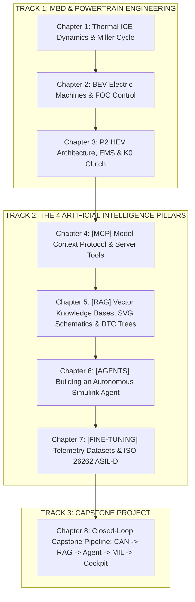

# NexusMBD // Master Curriculum & Course Syllabus
## AI-Native Powertrain Engineering Suite: Model-Based Design & The 4 AI Pillars

**Author:** Eng. Marley Rosa Luciano | **Program:** NexusMBD AI-Native Powertrain Suite  
**Course Status:** Validated and executable production-grade codebase in repository.  
**Estimated Workload:** 60 Hours (Mathematical Theory, MBD Modeling, MIL Labs & AI Implementation).  
**Target Audience:** Automotive Systems Engineers, Control & Calibration Engineers, Embedded Software Developers & Automotive AI/ML Engineers.

---

## 🎯 Pedagogical Philosophy

**NexusMBD** breaks down the barrier between traditional automotive engineering (**Model-Based Design in MATLAB/Simulink**) and **Frontier Artificial Intelligence**.

The program is engineered so the student is not merely a tool consumer, but **the architect who constructs every component of the cyber-physical ecosystem**:
1. **In the [AGENT] Pillar:** The student builds from scratch an autonomous ReAct Agent capable of launching Simulink, injecting test vectors, and calibrating closed-loop controllers.
2. **In the [RAG] Pillar:** The student connects, indexes, and retrieves mission-critical technical sources (high-voltage workshop manuals, SVG topology schematics, and structured DTC fault trees).
3. **In the [FINE-TUNING] Pillar:** The student creates synthetic physical telemetry datasets, formats domain-specific prompts, and trains models compliant with **ISO 26262 (ASIL-D)**.
4. **In the [MCP] Pillar:** The student implements JSON-RPC servers with robust industrial CAN DBC decoders and 100ms real-time streaming buffers.

---

## 🗺️ Complete Curriculum & Module Map

---

## 📘 Comprehensive Chapter Syllabus & Hands-On Laboratory Program

### CHAPTER 1: Thermal ICE Dynamics, Miller Cycle & MBD Architecture
* **Engineering Domain:** Internal Combustion Thermodynamics and Compressible Fluid Mechanics.
* **Core Topics:**
  * The thermodynamic principle of the Miller Cycle with Early Intake Valve Closing (EIVC).
  * Synergistic torque fill: PMSM low-end torque bridging the Miller Cycle dynamic lag.
  * Continuous differential equations for Manifold Absolute Pressure ($P_m$) via the *Speed-Density* method.
  * Brake Specific Fuel Consumption (BSFC) look-up maps and analytical Sweet Spot location ($230\text{ g/kWh} \implies 41\%$ thermal efficiency).
  * Model architectural segregation into 4 MBD Solvers (`COMUNICACAO`, `SOFTECU`, `MDL`, `OUT`).
* **Hands-On Engineering Laboratories:**
  * **Lab 1.1 — Intake Manifold Dynamic Step Response:** Simulate throttle angle transient ($15\% \to 85\%$), solve $\dot{P}_m = \frac{R T_m}{V_m}(\dot{m}_{ai} - \dot{m}_{ao})$, and measure manifold filling time constant ($\tau = 42\text{ ms}$).
  * **Lab 1.2 — 2D BSFC Sweet Spot Optimization & ECU Clamping:** Sweep BMEP ($2 \to 14\text{ bar}$) across engine speeds ($1200 \to 4500\text{ RPM}$), construct the 2D BSFC contour surface, and program the ECU load-point clamp to lock ICE operation in the $230\text{ g/kWh}$ zone.
  * **Lab 1.3 — 4-Mains Solver MIL Architecture Integration:** Validate deterministic signal routing between `COMUNICACAO`, `SOFTECU`, `MDL`, and `OUT` in `MIL_MarleyOS_Powertrain.slx` ensuring zero algebraic loops under ode4 solver.
* **Student Practical Deliverables:** Python validation script (`powertrain_models.py`), BSFC contour plot, and passing 4-Mains MIL execution log.

---

### CHAPTER 2: Electrification, PMSM Machines & Field-Oriented Control (FOC)
* **Engineering Domain:** Permanent Magnet Synchronous Machines and Real-Time Vector Control.
* **Core Topics:**
  * Operating principles of Interior Permanent Magnet Synchronous Motors (IPMSM).
  * Power-invariant Clarke ($abc \to \alpha\beta$) and Park ($\alpha\beta \to dq$) transforms.
  * Field-Oriented Control (FOC): Decoupling magnetic flux ($I_d$) from electromagnetic torque ($I_q$).
  * Space Vector Pulse Width Modulation (SVPWM) and high-voltage 3-phase inverter switching.
  * Analytical sizing of PI current loops and anti-windup clamping.
* **Hands-On Engineering Laboratories:**
  * **Lab 2.1 — Vector Transformation & Power Invariance Proof:** Inject balanced 3-phase currents ($i_a, i_b, i_c$), compute $\alpha\beta$ and $dq$ projections across varying rotor angles $\theta_e$, and verify $i_a^2 + i_b^2 + i_c^2 = \frac{3}{2}(i_d^2 + i_q^2)$.
  * **Lab 2.2 — PI Current Loop Sizing with Anti-Windup Clamping:** Program analytical pole-zero cancellation ($K_p = \omega_{bw}L$, $K_i = \omega_{bw}R_s$) for $f_{bw} = 500\text{ Hz}$, implement voltage-saturation anti-windup clamping ($V_{\max} = V_{dc}/\sqrt{3}$), and verify $0 \to 200\text{ A}$ step response in $t_r < 3.5\text{ ms}$ with $<4\%$ overshoot.
  * **Lab 2.3 — MTPA (Maximum Torque Per Ampere) Trajectory & Flux-Weakening:** Compute optimal $i_d^*(i_q)$ trajectory exploiting motor saliency ($L_q > L_d$), quantify reluctance torque contribution ($T_{rel} > 8\text{ N}\cdot\text{m}$), and evaluate high-speed flux-weakening extension up to $6500\text{ RPM}$.
* **Student Practical Deliverables:** Calibration routine (`export_pmsm_calibration.m`), FOC step response dataset, and MTPA trajectory look-up table.

---

### CHAPTER 3: P2 Hybrid Architecture, EMS Strategy & K0 Clutch
* **Engineering Domain:** Parallel Hybrid Powertrains and Electro-Hydraulic Clutch Actuation.
* **Core Topics:**
  * Kinematics and dynamic coupling of the P2 topology (ICE &rarr; K0 &rarr; PMSM &rarr; e-DCT).
  * State-machine modeling of the 4 K0 clutch states: `OPEN`, `SYNC`, `SLIP`, `LOCKED`.
  * Energy Management Strategy (EMS): Pure EV Mode, Hybrid Boost, Charge-in-Motion, and Regenerative Braking.
  * Dual-clutch e-DCT transmission dynamics (C1 odd gears, C2 even gears).
* **Hands-On Engineering Laboratories:**
  * **Lab 3.1 — 4-State K0 Electro-Hydraulic Clutch Cycling:** Simulate hot-start transition from EV Mode, modulating hydraulic pressure $P_{k0}$ from kiss-point ($0.5\text{ bar}$) to full engagement ($8.0\text{ bar}$), cranking the engine to $1200\text{ RPM}$ in $<250\text{ ms}$.
  * **Lab 3.2 — Driveline Jerk Suppression & Active Torque Fill:** Implement feedforward motor counter-torque during K0 slip phase, verifying driveline jerk remains strictly below automotive comfort limits ($j < 2.0\text{ m/s}^3$).
  * **Lab 3.3 — e-DCT Dual-Shaft Power-Shift Gear Handover:** Model pre-selection of 2nd gear on hollow shaft (C2) during 1st gear cruise on solid shaft (C1), executing overlapping clutch pressure ramp with zero torque hole at the wheels.
* **Student Practical Deliverables:** K0 hot-start Simulink dataset, driveline jerk analysis report, and e-DCT power-shift telemetry capture.

---

### CHAPTER 4: [MCP] Model Context Protocol — Building Industrial Server Tools
* **AI Domain:** MCP Architecture, JSON-RPC Protocol, and Real-Time Telemetry Interfaces.
* **Core Topics:**
  * FastMCP server architecture, standard IO (`stdio`) transport, and protocol negotiation.
  * Industrial CAN DBC file parsing and bitwise signal packing/unpacking.
  * Real-time circular buffer management and high-frequency telemetry streaming.
* **Hands-On Engineering Laboratories:**
  * **Lab 4.1 — Industrial CAN DBC Parser & Bitwise Decoder:** Build a Python parser that reads `Model/powertrain_bus.dbc`, extracts message IDs (`0x100`, `0x101`, `0x200`), start bits, lengths, scale factors, and offsets, supporting both Motorola and Intel byte orders.
  * **Lab 4.2 — 100ms Streaming JSON-RPC Server & Ring Buffer:** Implement the MCP tool `read_can_telemetry(channels)` connected to a 1000-frame rolling ring buffer, benchmarking latency under 100ms real-time queries.
  * **Lab 4.3 — CAN Bus Fault Injection & Active DTC Tooling:** Create the MCP tool `inject_fault_code(ecu_id, dtc)`, inject simulated CRC errors and bus-off events, and verify that the diagnostic registry updates within 2 sample cycles.
* **Student Practical Deliverables:** Operational MCP server (`mcp_server.py`), DBC decoder test script, and JSON-RPC diagnostic capture logs.

---

### CHAPTER 5: [RAG] Retrieval-Augmented Generation — Connecting Authoritative Engineering Sources
* **AI Domain:** Vector Databases, High-Dimensional Embeddings, and Multimodal Semantic Retrieval.
* **Core Topics:**
  * Multimodal ingestion of high-voltage workshop manuals, electrical pinouts, and vector SVG schematics.
  * Hybrid semantic search combining dense neural embeddings with sparse BM25 lexical token matching.
  * Diagnostic Trouble Code (DTC) decision-tree resolution pipelines.
* **Hands-On Engineering Laboratories:**
  * **Lab 5.1 — Multimodal Ingestion & High-Dimensional Semantic Chunking:** Ingest workshop manuals, parse `p2_powertrain_topology.svg` into topological graph nodes, generate dense vector embeddings, and store them in Chroma DB.
  * **Lab 5.2 — Hybrid Search Engine (Dense Embeddings + Sparse BM25):** Implement Reciprocal Rank Fusion (RRF) combining cosine distance and BM25 exact alphanumeric scoring for alphanumeric symbols and fault codes (`P0A80`, `P0606`, `C0035`, `P0AA6`).
  * **Lab 5.3 — Automated DTC Diagnostic Decision Tree Execution:** Build an interactive pipeline that takes raw DTCs, retrieves the exact pinout diagram, outputs multimeter step-by-step isolation procedures, and safety lockout instructions.
* **Student Practical Deliverables:** Hybrid RAG pipeline script (`rag_engine.py`), indexed vector store, and automated DTC troubleshooting benchmark report.

---

### CHAPTER 6: [AGENTS] Autonomous Simulink Calibration Agents — Building an Agent from Scratch
* **AI Domain:** ReAct Cognitive Loops (Reasoning + Acting), LangGraph/CrewAI, and Automated MIL/SIL Testing.
* **Core Topics:**
  * Programmatic orchestration of MATLAB/Simulink via `matlab-mcp-core-server` and `Simulink.SimulationInput`.
  * ReAct cognitive loop: **Thought** &rarr; **Action (Tool Call)** &rarr; **Observation** &rarr; **Reflection**.
  * Integral error cost metrics and automated closed-loop parameter tuning.
* **Hands-On Engineering Laboratories:**
  * **Lab 6.1 — Autonomous ReAct Cognitive Loop Engine:** Construct the Python ReAct loop, integrating tool calls `get_model_workspace()`, `set_calibration_param()`, `run_simulink_mil()`, and `get_simulation_metrics()`.
  * **Lab 6.2 — Autonomous PI Gain Sizing via Closed-Loop ITAE Cost Metric:** Set the agent objective: *"Eliminate electric torque overshoot (<5%) while keeping rise time under 30ms"*, allowing the agent to run 5 successive MIL iterations minimizing $\text{ITAE} = \int_0^T t \cdot |e_{\tau}(t)| \, dt$.
  * **Lab 6.3 — Automated Boundary Sweep & Hydraulic Stability Discovery:** Equip the agent to sweep K0 pressure targets ($1.0 \to 12.0\text{ bar}$), autonomously identify cavitation limits and clutch glazing zones, and generate an optimal safe calibration window.
* **Student Practical Deliverables:** ReAct agent script (`simulink_react_agent.py`), convergence trajectory log, and automated calibration report.

---

### CHAPTER 7: [FINE-TUNING] LLM Domain Specialization & ISO 26262 ASIL-D Alignment
* **AI Domain:** Telemetry Dataset Engineering, Supervised Fine-Tuning (SFT) with LoRA/QLoRA, and Functional Safety.
* **Core Topics:**
  * Synthetic physical telemetry dataset engineering from continuous drive cycles.
  * Parameter-Efficient Fine-Tuning (PEFT / LoRA) of open-weights foundation models.
  * Functional safety verification, Hazard Analysis and Risk Assessment (HARA), and ASIL-D compliance.
* **Hands-On Engineering Laboratories:**
  * **Lab 7.1 — Synthetic Multi-Scenario Telemetry Dataset Generation:** Execute WLTP and aggressive transient simulations, synthesizing 1,000+ structured instruction-input-output pairs in `.jsonl` format mapping sensor states to certified engineering actions.
  * **Lab 7.2 — Parameter-Efficient LoRA SFT on Domain Diagnostics:** Configure LoRA ($r=16, \alpha=32$, target modules `q_proj`, `v_proj`), train an open-weights model on powertrain diagnostic reasoning, and record cross-entropy loss convergence.
  * **Lab 7.3 — ISO 26262 ASIL-D Functional Safety & Adversarial Audit:** Subject the fine-tuned model to adversarial safety probes (e.g., conflicting throttle/brake commands), verifying strict adherence to Safety Goals (SPFM $\ge 99\%$) with zero hazardous hallucinations.
* **Student Practical Deliverables:** Validated `telemetry_finetune.jsonl` dataset, LoRA adapter configuration, and ISO 26262 ASIL-D safety audit certificate.

---

### CHAPTER 8: Capstone Project — The Closed End-to-End Autonomous Pipeline
* **Engineering & AI Domain:** Complete Cyber-Physical System Integration.
* **Core Topics:**
  * Full real-time integration of CAN Streaming [MCP], Semantic Retrieval [RAG], Autonomous Optimization [AGENTS], and Safety Auditing [FINE-TUNING].
  * Closed-loop fail-safe mitigation and Web Cockpit real-time telemetry rendering.
  * Formal 300-point Capstone Certification Examination.
* **Hands-On Engineering Laboratories:**
  * **Lab 8.1 — Full Closed Cyber-Physical Pipeline Execution:** Connect live CAN streaming [MCP] to anomaly monitoring [RAG], autonomous troubleshooting [AGENTS], safety compliance audit [FINE-TUNING], and visual cockpit verification at `http://localhost:8080`.
  * **Lab 8.2 — High-Voltage Isolation Breakdown In-Flight Mitigation:** Inject severe high-voltage loss of isolation (`P0AA6`) during 110 km/h cruising; verify coordinated fail-safe response (K0 clutch open, inverter de-energized, safe coastdown).
  * **Lab 8.3 — End-to-End Certification Examination:** Execute `evaluate_course.py`, validating 100% of all unit tests, analytical problems, and capstone milestones to earn the official cryptographic SHA-256 certificate.
* **Student Practical Deliverables:** End-to-end capstone execution log (`capstone_report.txt`), official digital certificate, and final system architecture walkthrough.

---

## 🛠️ Competency Matrix & Hands-On Deliverables (24 Labs Total)

| Module | Core Competency | 3 Hands-On Laboratory Practices | Primary Technology Stack |
| :--- | :--- | :--- | :--- |
| **Module 1: ICE** | Miller Cycle, MAP, BSFC Sweet Spot | **Lab 1.1:** Intake Manifold Dynamic Step Response **Lab 1.2:** 2D BSFC Sweet Spot Optimization & Clamping **Lab 1.3:** 4-Mains Solver MIL Architecture Integration | Python / NumPy / MATLAB ODE |
| **Module 2: BEV** | FOC, Clarke/Park, SVPWM, Inverter | **Lab 2.1:** Vector Transformation & Power Invariance Proof **Lab 2.2:** PI Current Loop Sizing with Anti-Windup **Lab 2.3:** MTPA Saliency Trajectory & Flux-Weakening | MATLAB MBD / Simulink |
| **Module 3: HEV** | P2 Topology, K0 Dynamics, e-DCT | **Lab 3.1:** 4-State K0 Electro-Hydraulic Clutch Cycling **Lab 3.2:** Driveline Jerk Suppression & Active Torque Fill **Lab 3.3:** e-DCT Dual-Shaft Power-Shift Gear Handover | Simulink 4-Mains / Stateflow |
| **Module 4: [MCP]** | JSON-RPC, CAN DBC, Telemetry Buffer | **Lab 4.1:** Industrial CAN DBC Parser & Bitwise Decoder **Lab 4.2:** 100ms Streaming JSON-RPC Server & Ring Buffer **Lab 4.3:** CAN Bus Fault Injection & Active DTC Tooling | FastMCP / Python / CAN DBC |
| **Module 5: [RAG]** | Vector DB, Hybrid BM25, DTC Trees | **Lab 5.1:** Multimodal Ingestion & High-Dimensional Chunking **Lab 5.2:** Hybrid Search Engine (Embeddings + BM25) **Lab 5.3:** Automated DTC Diagnostic Decision Tree Execution | Chroma DB / BM25 / KaTeX |
| **Module 6: [AGENTS]** | ReAct Loop, Programmatic Simulink | **Lab 6.1:** Autonomous ReAct Cognitive Loop Engine **Lab 6.2:** Autonomous PI Gain Sizing via Closed-Loop ITAE **Lab 6.3:** Automated Boundary Sweep & Hydraulic Discovery | Python / LangGraph / ReAct |
| **Module 7: [FINE-TUNING]**| SFT, LoRA, ISO 26262 ASIL-D | **Lab 7.1:** Synthetic Multi-Scenario Telemetry Dataset (`.jsonl`) **Lab 7.2:** Parameter-Efficient LoRA SFT on Diagnostics **Lab 7.3:** ISO 26262 ASIL-D Functional Safety & Audit | PyTorch / HuggingFace / JSONL |
| **Module 8: Capstone** | Cyber-Physical Integration | **Lab 8.1:** Full Closed Cyber-Physical Pipeline Execution **Lab 8.2:** High-Voltage Isolation Breakdown Mitigation **Lab 8.3:** End-to-End Certification Examination | Full NexusMBD Suite |

---

## 📅 Course Roadmap (60 Hours Across 12 Weeks)

* **Weeks 1 & 2:** MBD Fundamentals & ICE Thermodynamics (Labs 1.1 to 1.3).
* **Weeks 3 & 4:** BEV Electrification & FOC Vector Control (Labs 2.1 to 2.3).
* **Weeks 5 & 6:** P2 Hybrid Architecture, K0 Clutch & e-DCT (Labs 3.1 to 3.3).
* **Weeks 7 & 8:** The [MCP] Pillar — Industrial CAN DBC & Tool Server (Labs 4.1 to 4.3).
* **Weeks 9 & 10:** The [RAG] Pillar — Multimodal Knowledge Base & DTC Trees (Labs 5.1 to 5.3).
* **Weeks 11 & 12:** The [AGENTS] Pillar — Autonomous Simulink Calibration Agent (Labs 6.1 to 6.3).
* **Weeks 13 & 14:** The [FINE-TUNING] Pillar — Telemetry Datasets & ASIL-D Safety (Labs 7.1 to 7.3).
* **Weeks 15 & 16:** Capstone Integration, Fail-Safe Testing & Certification Exam (Labs 8.1 to 8.3).
