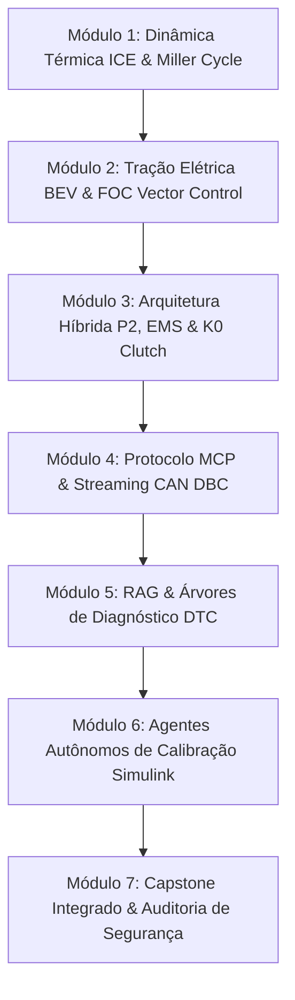

# NexusMBD // AI-Native Powertrain Engineering Suite

  
Autor: Eng. Marley Rosa Luciano

  [MCP] CAN Protocol
  [RAG] Knowledge Base
  [AGENTS] Simulink MBD
  [FINE-TUNING] ISO 26262

---

## 🚀 Sobre o Curso & A Plataforma

A **NexusMBD Engineering Suite** é um ecossistema educacional e prático projetado para capacitar engenheiros de sistemas automotivos no desenvolvimento, modelagem matemática, controle e validação de trens de força modernos (**ICE, BEV e Híbridos P2**).

A metodologia conecta o **Model-Based Design (MBD)** de alta fidelidade no MATLAB/Simulink às 4 fronteiras da Inteligência Artificial:

1. **[MCP] Model Context Protocol:** Servidor JSON-RPC que decodifica barramentos CAN DBC e expõe canais de telemetria contínuos como ferramentas (*tool calls*) para Grandes Modelos de Linguagem (LLMs).
2. **[RAG] Retrieval-Augmented Generation:** Base de conhecimento técnico vetorial com esquemas de topologia P2, manuais de alta tensão e procedimentos estruturados para isolamento de códigos de falha (DTCs).
3. **[AGENTS] Simulink MIL Automation:** Agentes ReAct autônomos que orquestram os solvers 4 Mains (`COMUNICACAO`, `SOFTECU`, `MDL`, `OUT`), ajustam parâmetros de malhas de corrente PI e executam testes em lote.
4. **[FINE-TUNING] LLM Domain Model:** Modelos de linguagem adaptados com datasets proprietários de dinâmica veicular e regras de segurança funcional segundo a **ISO 26262 (ASIL-D)**.

---

## 📚 Estrutura da Formação

---

## 🖥️ Cockpit de Telemetria ao Vivo

O sistema conta com um cockpit telemétrico interativo a 60 FPS servido localmente e acessível por dispositivos móveis na mesma rede:
* **URL Local (PC):** `http://localhost:8080`
* **URL Móvel (Wi-Fi):** `http://192.168.1.22:8080`
* **Integração Termux (Android):** Consumo de fluxo CAN via `curl -s http://192.168.1.22:8080/api/telemetry | jq .`
