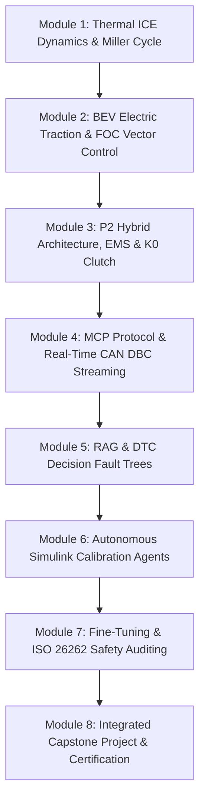

# NexusMBD // AI-Native Powertrain Engineering Suite

  
Author: Eng. Marley Rosa Luciano

  [MCP] CAN Protocol
  [RAG] Knowledge Base
  [AGENTS] Simulink MBD
  [FINE-TUNING] ISO 26262

---

## 🚀 About the Program & Platform

The **NexusMBD Engineering Suite** is an advanced educational and practical ecosystem designed to empower automotive systems engineers in the mathematical modeling, control, and validation of state-of-the-art powertrains (**ICE, BEV, and P2 Hybrids**).

The curriculum bridges high-fidelity **Model-Based Design (MBD)** in MATLAB/Simulink with the 4 frontiers of Artificial Intelligence:

1. **[MCP] Model Context Protocol:** JSON-RPC tool server decoding industrial CAN DBC streams and serving 100ms real-time telemetry to Large Language Models (LLMs).
2. **[RAG] Retrieval-Augmented Generation:** Vectorized engineering knowledge base with P2 topology schematics, high-voltage workshop manuals, and structured diagnostic trouble code (DTC) procedures.
3. **[AGENTS] Simulink MIL Automation:** Autonomous ReAct agents orchestrating the 4 Mains solvers (`COMUNICACAO`, `SOFTECU`, `MDL`, `OUT`), tuning PI current loops, and executing batch simulations.
4. **[FINE-TUNING] LLM Domain Model:** Foundation models adapted with proprietary vehicle dynamics datasets and functional safety verification rules under **ISO 26262 (ASIL-D)**.

---

## 📚 Course Curriculum Map

---

## 🖥️ Live Telemetry Web Cockpit

The platform features an interactive real-time telemetry cockpit operating locally and accessible across devices on the local network:
* **Local Web URL (PC):** `http://localhost:8080`
* **Executive Master Slides (English):** `http://localhost:8080/slides-en`
* **Official Digital Certificate:** `http://localhost:8080/certificado`
* **Termux Android Integration:** Stream raw CAN frames via `curl -s http://localhost:8080/api/telemetry | jq .`
